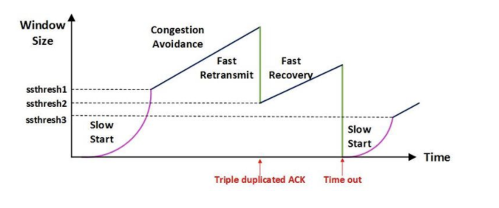
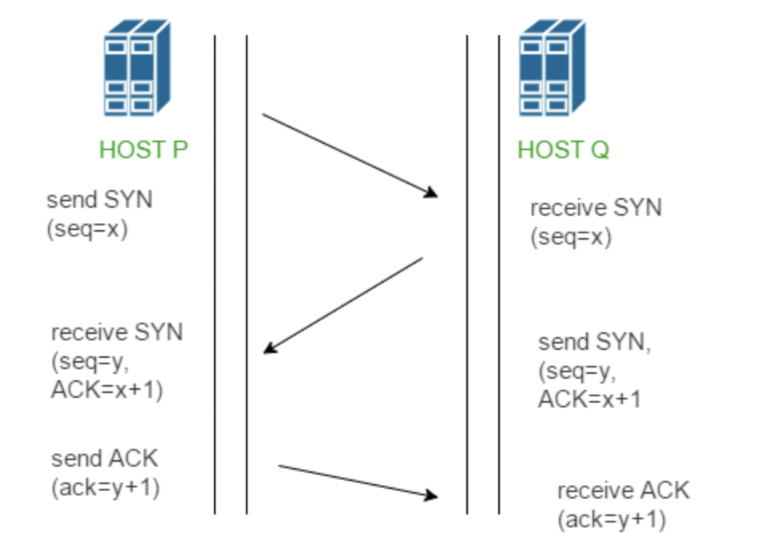
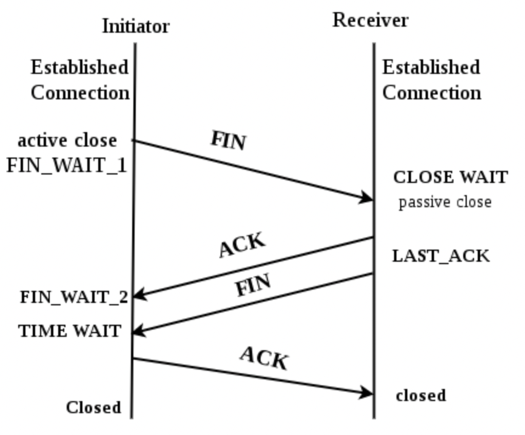

# 네트워크

1. OSI 7 Layer 에 대해 설명하시오.

   > 7계층을 나누는 이유? 통신이 일어나는 과정을 단계별로 알 수 있고, 특정한 곳에 이상이 생기면 그 단계만 수정할 수 있기 때문이다.

   
   
   

- Physical Layer (물리 계층)

  > 주로 전기적, 기계적, 기능적 특성을 이용해서 통신 케이블로 데이터를 전송, 이 계층에서 사용되는 통신 단위는 1과 0으로 나타내어 지는 비트 이다. 단지 전기적인 신호를 주고받는 공간
  - 데이터를 전달만 한다. 송신, 수신 데이터가 무엇인지, 어떤 에러가 있는지 등은 신경 쓰지 않는다.
  - 케이블, 리피터, 허브를 통해 데이터를 전송한다.

* DataLink Layer (데이터 링크 계층)

  > 물리 계층을 통해 송수신되는 정보의 **오류와 흐름**을 관리하여 안전한 정보의 전달을 수행할 수 있도록 도와주는 역할을 한다. (Point to Point 신뢰성 보장)
  * 통신에서의 오류 찾아주고, **재전송** 하는 기능도 가지고 있다. CRC 기반의 오류 제어와 흐름 제어가 필요하다.

  * 네트워크 레이어 위의 개체들 간 데이터를 전달하고, 물리 계층에서 발생할 수 있는 오류를 찾아 내고, 수정하는 데 필요한 기능적, 절차적 수단을 제공한다. 

  * 주소 값은 물리적으로 할당 받은 맥 주소 (**Mac address**) 를 가지고 통신한다. 이는 네트워크 카드가 만들어질 때부터 맥 주소가 정해져 있다는 뜻이다.

  * 이 계층에서 전송되는 단위를 프레임 이라고 하며 대표적으로 **브리지, 스위치** 등의 장비가 여기 속한다.

* Network Layer (네트워크 계층)

  > 데이터를 목적지까지 가장 안전하고 빠르게 전달하는 기능(**라우팅, routing**)을 담당하는 구간이다.

  * 라우터를 통해 이동할 경로를 선택하여 IP 주소를 지정하고, 해당 경로에 따라 패킷을 전달한다.
  * 라우팅, 흐름 제어, 세그멘테이션(segmentation), 오류 제어, 인터네트워킹 등을 수행한다.
  * 데이터를 연결하는 다른 네트워크를 통해 전달함으로써 인터넷이 가능하게 만든다.
  * 논리적인 주소 구조 (**IP address**), 즉 네트워크 관리자가 직접 주소를 할당하는 구조, 계층적(hierarchical)
  * 대표적인 장비로 **라우터(Router)**가 있고, 스위치에 라우팅 기능을 구현한 장비도 속한다.

- Transport Layer (전송 계층)

  >  통신을 활성화 하기 위한 계층, 포트를 열어서 응용프로그램들이 전송을 할 수 있게 한다. 양끝 단(End to end)의 사용자들이 신뢰성 있는 데이터를 주고 받을 수 있도록 해서, 상위 계층들이 데이터 전달의 유효성이나 효율성을 생각하지 않도록 해준다.

  - 시퀀스 넘버 기반의 오류 제어 방식을 사용한다.
  - 전송 계층은 특정 연결의 유효성을 제어하고, 일부 프로토콜은 상태 개념이 있고(stateful), 연결 기반(connection oriented)이다. -> 전송 계층은 패킷들의 전송이 유효한지 확인하고 전송 실패한 패킷들을 다시 전송한다.
  - 기능은 오류 검출 및 복구와 흐름 제어, 중복 검사 등을 수행한다.
  - 패킷 생성 (Assembly/Sequencing/Error detection/Request repeat/flow control) 및 전송 

* Session Layer (세션 계층)

  > 데이터가 통신하기 위한 논리적인 연결을 뜻한다. TCP/IP 세션 설정, 유지 종료, 전송 중단 시 복구 등의 기능이 있다.

  * 양끝 단의 응용 프로세스가 통신을 관리하기 위한 방법을 제공한다.
  * 동시 송수신 방식(duplex), 반이중 방식(half-duplex), 전이중 방식(full-duplex)의 통신과 함께 체크 포인팅과 유휴, 종료, 다시 시작 과정 등을 수행한다. 이 계층은 TCP/IP 세션을 만들고 없애는 책임을 진다.
  * 통신하는 사용자들을 동기화하고 오류 복구 명령들을 일괄적으로 다룬다.
  * 통신을 하기 위한 세션을 확립/유지/중단 (OS)

* Presentation Layer (표현 계층)

  > 데이터 표현이 상이한 응용 프로세스의 독립성을 제공하고 암호화 한다. 코드 간의 번역을 담당하여 사용자 시스템에서 데이터의 형식상 차이를 다루는 부담을 응용 계층으로 덜어 준다. MIME 인코딩이나 암호화 등의 동작이 이루어진다.

  * Ex. EBCDIC로 인코딩된 문서 파일을 ASCII로 인코딩된 파일로 바꿔 주는 것
  * 해당 데이터가 text인지, 그림인지, GIF 혹은 JPG 인지의 구분
  * 사용자의 명령어를 완성 및 결과 표현, 포장/압축/암호화
  * JPEG, MPEG 등

* Application Layer (응용 계층)

  > 최종 목적지, HTTP, FTP, SMTP 등과 같은 다양한 프로토콜이 있다. 해당 통신 패킷들은 프로토콜에 의해 모두 처리되며, 브라우저나 메일 프로그램은 프로토콜을 보다 쉽게 사용하게 해주는 응용프로그램이다.

  * 응용 프로세스와 직접 관계하여 일반적인 응용 서비스를 수행한다. 일반적인 응용 서비스는 관련된 응용 프로세스들 사이의 전환을 제공한다.
  
  * 네트워크 소프트웨어 UI, 사용자의 입출력(I/O)부분
  
  * 사용자 인터페이스, 전자우편, 데이터베이스 관리 등의 서비스를 제공
  
  * HTTP, FTP, DNS 등
  
    * HTTP 프로토콜 (HyperText Transfer Protocol)
  
      > 웹 상에서 웹 서버 및 웹 브라우저 상호 간의 데이터 전송을 위한 응용계층 프로토콜
  
      * 처음에는, www 상의 하이퍼텍스트 형태의 문서를 전달하는데 주로 이용했고, 현제에 들어서는 이미지, 비디오, 음성 등 거의 모든 형식의 데이터 전송이 가능한다.

---

2. TCP와 UDP는 왜 나오게 됐는가?

   1. IP의 역할은 Host to Host (장치 to 장치)만을 지원한다. 장치에서 장치로 이동은 IP로 해결되지만, 하나의 장비 안에서 수많은 프로그램들이 통신을 할 경우에는 IP만으로는 한계가 있다.
   2. 또한, IP에서 오류가 발생한다면 ICMP에서 알려준다. 하지만, ICMP는 알려주기만 할 뿐 대처를 못하기 때문에 IP보다 위에서 처리를 해줘야 한다.

   * 1번을 해결하기 위하여 포트 번호가 나오게 됐고, 2번을 해결하기 위해 상위 프로토콜인 TCP와 UDP가 나오게 되었다.
   * ICMP : 인터넷 제어 메세지 프로토콜로 네트워크 컴퓨터 위에서 돌아가는 운영체제에서 오류 메세지를 전송받는데 주로 쓰임

3. TCP와 UDP가 어떻게 오류를 해결하는가?

   * TCP : 데이터의 분실, 중복, 순서 바뀜 등을 자동으로 보정해줘서 송수신 데이터의 정확한 전달을 할 수 있도록 해준다.
   * UDP : IP가 제공하는 정도의 수준만을 제공하는 간단한 IP 상위 계층의 프로토콜이다. TCP와는 다르게 에러가 날 수도 있고, 재전송이나 순서가 뒤바뀔 수도 있어서 이 경우, 어플리케이션에 처리하는 번거로움이 존재한다.

4. TCP 와 UDP 에 대해서 설명하시오
   * TCP : 양 종단 호스트 내 프로세스 상호 간에 신뢰 있는 연결 지향성 서비스를 제공한다.
     * 1)   신뢰성 있음 (Reliable)
       * 패킷 손실, 중복, 순서 바뀜, Congestion(네트워크 혼잡), Overload(receiver 가 overload 되는 문제) 등이 없도록 보장
       * TCP의 하위 계층인 IP계층의 신뢰성 없는 서비스에 대해 다방면으로 신뢰성을 제공
     * 2)   연결 지향적 (Connection-oriented)
       * UDP 가 비연결성(connectionless)인 것과 달리, TCP는 연결지향적이다. 연결 관리를 위한 연결 설정 및 연결 해제가 필요하다. 양 단간 어플리케이션/프로세스는 TCP가 제공하는 연결성 회선을 통하여 서로 통신한다.
     
   * UDP : 신뢰성이 낮은 프로토콜로써 완전성을 보증하지 않으나, 가상 회선을 굳이 확립할 필요가 없고 유연하다.
     * 1)   비연결성, 신뢰성 없음, 순서화 되지 않은 datagram
       * 메세지가 제대로 도착했는지 확인하는 확인 응답이 없고(확인 응답 없음), 수신된 메세지의 순서를 맞추지 않는다.(순서 제어 없음)
       * 흐름 제어 없음, 오류 제어 거의 없음 (checksum 만 제공)
       * 따라서 UDP를 사용하는 프로그램 쪽에서 오류 제어 기능을 스스로 갖추어야 한다. 또한, 데이터 그램 지향의 전송 계층 용 프로토콜이라 논리적인 가상 회선 연결이 필요 없다.
     * 2)   실시간 응용 및 멀티 캐스팅 가능
       * 빠른 요청과 응답이 필요한 실시간 응용에 적합하고, 여러 다수 지점에 전송이 가능하다 (1대다)
     * 3)   헤더(Header)가 단순함
       * UDP는 TCP처럼 16bit의 포트 번호를 사용하나, 헤더는 고정 크기의 8byte만 사용한다. (TCP는 20byte) 따라서, 헤더 처리에 많은 시간과 노력을 요하지 않는다.

5. TCP/IP 의 흐름제어 & 혼잡제어에 대해서 설명하시오

   > 흐름 제어 : 송신측과 수신측의 데이터 처리 속도 차이를 해결하기 위한 기법, Flow control  은 receiver 가 packet을 지나치게 많이 받지 않도록 조절 하는 것, 기본 개념은 receiver 가 sender 에게 현재 자신의 상태를 feedback 한다는 것이다.
   >
   > 혼잡 제어 : 송신측의 데이터 전달과 네트워크의 데이터 처리 속도 차이를 해결하기 위한 기법 (network congestion avoidance algorithm을 사용)

   전송의 전체 과정

   1. Application Layer : sender application layer 가 socket에 data를 씀
   2. Transport Layer : data를 segment에 감싼다. 그리고 Nework Layer에 넘김
   3. 아랫단에서 receiving node로 데이터를 전송한다. 이때, sender의 send buffer에 data를 저장하고, receiver는 receive buffer에 data를 저장한다.

   즉, flow control 의 핵심은 이 receiver buffer 가 넘치지 않게 하는 것이다.

   따라서 receiver 는 RWND(Receive WiNDow = receiver buffer) 의 남은 공간을 홍보한다.

   * **흐름 제어 (Flow Control)**

     * 수신측의 데이터 처리 속도보다 송신측의 데이터 전송 속도가 빠를 경우 문제 발생

     * 수신측에서 제한된 저장 용량을 초과한 이후에 도착하는 데이터는 손실 될 수 있으며, 만약 손실 된다면 불필요한 응답과 데이터 전송이 서로 간에 빈번히 발생한다.
       -> 이러한 위험을 줄이기 위해 송신 측의 데이터 전송량을 수신측에 따라 조절 필요

     * 해결 방법

       * Stop and Wait : 매번 전송한 패킷에 대해 확인 응답을 받아야만 그 다음 패킷을 전송하는 방법

       * Sliding Window (Go Back N ARQ)

         * 수신측에서 설정한 윈도우 크기만큼 송신측에서 확인 응답 없이 세그먼트를 전송할 수 있게 하여 데이터 흐름을 동적으로 조절하는 제어방법

         * 목적 : 전송은 되었지만, acked를 받지 못한 byte 숫자를 파악하기 위해 사용하는 protocol

           > * LastByteSent - LastByteAcked <= ReceivecWindowAdvertised
           >
           > * 마지막에 보내진 바이트 - 마지막에 확인된 바이트 <= 남아있는 공간
           > * 즉, 현재 공중에 떠있는 패킷 수 <= sliding window

         * 동작 방식 : 먼저 윈도우에 포함되는 모든 패킷을 전송하고, 그 패킷들의 전달이 확인되는대로 이 윈도우를 옆으로 옮김으로써 그 다음 패킷들을 전송 하는 방식

         * window : TCP/IP 를 사용하는 모든 호스트들은 송신하기 위한 것과 수신하기 위한 2개의 window를 가지고 있다. 호스트들은 실제 데이터를 보내기 전에 3 way handshake 를 통해 수신 호스트의 receive window size에 자신의 send window size를 맞추게 된다.

   * **혼잡 제어 (Congestion Control)**

     * 송신측의 데이터는 지역망이나 인터넷으로 연결된 대형 네트워크를 통해 전달된다. 만약 한 라우터에 데이터가 몰릴 경우, 자신에게 온 데이터를 모두 처리할 수 없게 된다. 이런 경우 호스트들은 또 다시 재전송을 하게되고 결국 혼잡만 가중시켜 오버플로우나 데이터 손실을 발생시키게 된다. 따라서 이러한 네트워크의 혼잡을 피하기 위해 송신측에서 보내는 데이터의 전송속도를 강제로 줄이게 되는데, 이를 혼잡제어라고 한다. 또한, 네트워크 내에 패킷의 수가 과도하게 증가하는 현상을 혼잡이라 하며, 혼잡 현상을 방지하거나 제거하는 기능을 혼잡제어라고 한다.
     
     * 흐름제어가 송신측과 수신측 사이의 전송속도를 다루는데 반해, 혼잡제어는 호스트와 라우터를 포함한 보다 넓은 관점에서 전송 문제를 다루게 된다.
     
     * 해결 방법
       
       
       
       * AIMD (Additive Increase / Multiplicative Decrease)
         * 처음에 패킷을 하나씩 보내고 이것이 문제없이 도착하면 window 크기 (단위 시간 내에 보내는 패킷의 수)를 1씩 증가시키며 전송하는 방법
         * 패킷 전송에 실패하거나 일정 시간을 넘으면 패킷의 보내느 속도를 절반으로 줄인다.
         * 공평한 방식으로, 여러 호스트가 한 네트워크를 공유하고 있으면 나중에 진입하는 쪽이 처음에는 불리하지만, 시간이 흐르면 평형상태로 수렴하게 되는 특징이 있다.
         * 문제점은 초기에 네트워크의 높은 대역폭을 사용하지 못하여 오랜 시간이 걸리게 되고, 네트워크가 혼잡해지는 상황을 미리 감지하지 못한다. 즉, 네트워크가 혼잡해지고 나서야 대역폭을 줄이는 방식이다.
       * Slow Start
         * AIMD 방식이 네트워크의 수용량 주변에서는 효율적으로 작동하지만, 처음에 전송 속도를 올리는데 시간이 오래 걸리는 단점이 있다. 
         * Slow Start 방식은 AIMD와 마찬가지로 패킷을 하나씩 보내면서 시작하고, 패킷이 문제없이 도착하면 각각의 ACK 패킷마다 window size를 1씩 늘려준다. 즉, 한 주기가 지나면 window size가 2배로 된다.
         * 전송속도는 AIMD에 반해 지수 함수 꼴로 증가한다. 대신에 혼잡 현상이 발생하면 window size를 1로 떨어트리게 된다.
         * 처음에는 네트워크의 수용량을 예상할 수 있는 정보가 없지만, 한번 혼잡 현상이 발생하고 나면 네트워크의 수용량을 어느 정도 예상할 수 있다.
         * 그러므로 혼잡 현상이 발생하였던 window size의 절반까지는 이전처럼 지수 함수 꼴로 창 크기를 증가시키고 그 이후부터는 완만하게 1씩 증가시킨다.
       * Fast Retransmit (빠른 재전송)
         * 빠른 재전송은 TCP의 혼잡 조절에 추가된 정책이다. 
         * 패킷을 받는 쪽에서 먼저 도착해야할 패킷이 도착하지 않고 다음 패킷이 도착한 경우에도 ACK 패킷을 보내게 된다.
         * 단, 순서대로 잘 도착한 마지막 패킷의 다음 패킷의 순번을 ACK 패킷에 실어서 보내게 되므로, 중간에 하나가 손실되게 되면 송신 측에서는 순번이 중복된 ACK 패킷을 받게 된다. 이것을 감지하는 순간 문제가 되는 순번의 패킷을 재전송 해줄 수 있다.
         * 중복된 순번의 패킷을 3개 받으면 재전송을 하게 된다. 약간 혼잡한 상황이 일어난 것이므로 혼잡을 감지하고 window size를 줄이게 된다.
       * Fast Recovery (빠른 회복)
         * 혼잡한 상태가 되면 window size를 1로 줄이지 않고 반으로 줄이고 선형증가시키는 방법이다. 이 정책까지 적용하면 혼잡 상황을 한번 겪고 나서부터는 순수한 AIMD방식으로 동작하게 된다.

   

6. TCP 에서 3 way hand shake & 4 way handshake 에 대해서 설명하시오

   *  3 way handshake (연결 성립)
     

     * TCP 는 정확한 전송을 보장해야 한다. 따라서 통신 하기에 앞서, 논리적인 접속을 성립하기 위해 3 way handshake 과정을 진행한다.

     * 과정

       1. 클라이언트가 서버에게 SYN 패킷을 보냄 (sequence : x)
       2. 서버가 SYN(x)를 받고, 클라이언트로 받았다는 신호인 ACK와 SYN 패킷을 보냄 (sequence : y, ACK : x+1)
       3. 클라이언트는 서버의 응답은 ACK(x+1)과 SYN(y) 패킷을 받고, ACK(y+1)을 서버로 보냄

       이 과정으로 3번의 통신이 완료되면 연결이 성립

   * 4 way handshake (연결 해제)
     

     * 연결 성립 후, 모든 통신이 끝났다면 해제해야 한다.
     * 과정
       1. 클라이언트는 서버에게 연결을 종료한다는 FIN 플래그를 보낸다. 이때 클라이언트는 FIN_WAIT_1 상태로 들어가서 서버로 부터의 ACK 를 기다린다.
       2. 서버는 FIN을 받고, 확인했다는 ACK를 클라이언트에게 보낸다. (이때 모든 데이터를 보내기 위해 TIME OUT 상태가 된다) ACK 를 받고난 후 클라이언트는 FIN_WAIT_2 상태로 들어가서 서버로부터의 FIN 플래그를 기다린다.
       3. 서버쪽에서 ACK 를 보탠 후에 일정 시간이 지나고, 연결이 종료되었다는 FIN 플래그를 클라이언트에게 보낸다. (서버에서의 연결 해제 프로세스로 인해 일정 시간이 필요하다.)
       4. 클라이언트는 FIN을 받고, 확인했다는 ACK를 서버에게 보낸다. (아직 서버로부터 받지 못한 데이터가 있을 수 있거나 보낸 ACK가 전달이 되지 않았으면 다시 보내야 하니까 TIME_WAIT을 통해 기다린다.)
       5. 서버는 ACK를 받은 이후 소켓을 닫는다. (Closed)
       6. TIME_WAIT 시간이 끝나면 클라이언트도 닫는다. 이 과정에서 클라이언트 쪽의 포트 넘버와 버퍼 데이터 같은 자원이 풀린다. (Closed)

7. UDP 를 사용하는 이유는 무엇인가?

   * UDP의 결정적인 장점은 **데이터의 신속성**이다. 데이터의 처리가 TCP보다 빠르다.
   * 주로 실시간 방송과 온라인 게임에서 사용된다. 네트워크 환경이 안 좋을때, 끊기는 현상을 생각하면 된다.

8. DNS (Domain Name Service) 에서 UDP를 사용하는 이유는?

   > DNS는 UDP를 53 번 port에서 사용한다.

   * DNS는 데이터를 교환하는 경우이다. 이때, TCP를 사용하면 데이터를 송신할 때까지 세션 확립을 위한 처리를 하고, 송신한 데이터가 수신되었는지 점검하는 과정이 필요하므로, Protocol overhead가 UDP에 비해서 크다.
     * 즉, TCP가 3-way handshake를 사용하는 반면, UDP는 connection 을 유지할 필요가 없다.
   * DNS request는 UDP segment에 꼭 들어갈 정도로 작다.
     * DNS query는 single UDP request 와 server로부터의 single UDP reply로 구성되어 있다.
   * UDP 는 not reliable이지만, reliability는 application layer에 추가될 수 있다. (timeout 추가나, resend 작업을 통해)
   * 예외로, TCP를 사용하는 경우가 있는데 이는, Zone Transfer 를 사용하는 경우와 데이터가 512 bytes를 넘거나 응답을 못받은 경우이다. (Zone Transfer : DNS 서버 간의 요청을 주고 받을 때 사용하는 transfer)

9. 대칭키 (Symmetric Key) & 공개키 (Public Key)

   * 대칭키

     > 암호화와 복호화에 같은 암호키를 사용하는 알고리즘

     - 동일한 키를 주고받기 때문에 매우 빠르지만, 대칭키 전달과정에서 해킹 위험에 노출된다는 단점이 있다.

   * 공개키

     > 암호화와 복호화에 사용하는 암호키를 분리한 알고리즘

     * 자신이 가지고 있는 고유한 암호키(비밀키)로만 복호화할 수 있는 암호키(공개키)를 대중에 공개함
     * 공개키 암호화 진행 과정
       1. A가 웹 상에 공개된 'B의 공개키'를 이용해 평문을 암호화하여 B에게 보냄
       2. B는 자신의 비밀키로 복호화한 평문을 확인, A의 공개키로 응답을 암호화하여 A에게 보냄
       3. A는 자신의 비밀키로 암호화된 응답문을 복호화함
     * 대칭키의 단점을 완벽하게 해결했지만, 암호화 복호화가 매우 복잡함

   * 대칭키와 공개키 암호화 방식을 적절히 혼합해보면?

     * 이는 SSL 탄생의 시초가 됨
     * 대칭키를 주고받을 때만 공개키 암호화 방식을 사용하고, 이후에는 계속 대칭키 암호화 방식으로 통신하는 것
     * 진행 과정
       1. A가 B의 공개키로 암호화 통신에 사용할 대칭키를 암호화하고 B에게 보냄
       2. B는 암호문을 받고, 자신의 비밀키로 복호화함
       3. B는 A로부터 얻은 대칭키로 A에게 보낼 평문을 암호화하여 A에게 보냄
       4. A는 자신의 대칭키로 암호문을 복호화함
       5. 앞으로 이 대칭키로 암호화를 통신함

10. HTTP & HTTPS

    >HTTP : 인터넷 상에서 클라이언트와 서버가 자원을 주고 받을 때 쓰는 통신 규약
    >
    >- 텍스트 교환이므로, 누군가 네트워크에서 신호를 가로채면 내용이 노출되는 보안 이슈가 존재
    >
    >HTTPS : 인터넷 상에서 정보를 암호화하는 SSL 프로토콜을 이용해 클라이언트와 서버가 자원을 주고받을 때 쓰는 통신 규약
    >
    >- HTTPS는 텍스트를 암호화 한다. (공개키 암호화 방식으로)

    * HTTPS 통신 흐름

      1. 애플리케이션 서버(A)를 만드는 기업을 HTTPS를 적용하기 위해 공개키와 개인키를 만든다.

      2. 신뢰할 수 있는 CA 기업을 선택하고 그 기업에게 공개키 관리를 부탁하며 계약

         CA (Certificate Authority) 는 공개키를 저장해주는 신뢰성이 검증된 기업

      3. 해당 CA 기업은 해당 기업의 이름, A서버 공개키, 공개키 암호화 방법을 담은 인증서를 만들고, 해당 인증서를 CA기업의 개인키로 암호화해서 A서버에게 제공한다.

      4. A서버는 암호화된 인증서를 갖게 되었다. 이제 A서버는 A서버의 공개키로 암호화된 HTTPS 요청이 아닌 요청이 오면, 이 암호화된 인증서를 클라이언트에게 건내준다.

      5. 클라이언트는 main.html 파일을 달라고 A서버에 요청했다고 했을 때, HTTPS 요청이 아니기 때문에 CA기업이 A서버의 정보를 CA기업의 개인키로 암호화한 인증서를 받게 된다. 여기서 CA기업의 공개키는 브라우저가 이미 알고 있다. (세계적으로 신뢰할 수 있는 기업으로 등록이 되어 있으니, 브라우저가 인증서를 탐색하여 해독이 가능함)

      6. 브라우저는 이를 해독한 뒤 A서버의 공개키를 얻게 되었다. 이제 A서버와 통신할 때는 얻은 A서버의 공개키로 암호화해서 요청을 날리게 된다.

11. 로드 밸런싱 (Load Balancing)

    > 둘 이상의 CPU or 저장장치와 같은 컴퓨터 자원들에게 작업을 나누는 것

    - 많은 트래픽을 1 대의 서버가 감당하기 어렵다. 이에 대해 서버 하드웨어의 성능을 올리거나 (Scale-up) 여러대의 서버가 나눠서 일하도록 하는 것(Scale-out)이 있다.
    - 여기서, Scale-out 으로 여러 서버에게 균등하게 트래픽을 분산시켜주는 것이 로드 밸런싱이다.
    - Load Balancer를 클라이언트와 서버 사이에 두고, 부하가 이러나지 않도록 여러 서버에 분산시켜주는 방식
      - 로드 밸런서가 서버를 선택하는 방식
        - 라운드 로빈 : CPU 스케출링의 라운드 로빈 방식 활용
        - Least Connections : 연결 개수가 가장 적은 서버 선택 (트래픽으로 인해 세션이 길어지는 경우 권장)
        - Source : 사용자 IP를 해싱하여 분배 (특정 사용자가 항상 같은 서버로 연결되는 것 보장)

12. Blocking I/O & Non-Blocking I/O

    > I/O 작업은 kernel level에서만 수행할 수 있다. 따라서, Process, Thread 는 커널에게 I/O 를 요청해야 한다.

    * Blocking I/O

      (1) Process (Thread)가 kernel에게 I/O를 요청하는 함수를 호출

      (2) Kernel이 작업을 완료하면 작업 결과를 반환 받음

      - I/O 작업이 진행되는 동안 user process (Thread) 는 자신의 작업을 중단한 채 대기 (결과 출력을 기다리는 동안 다른 작업을 못함)
      - Resource 낭비가 심함 (I/O작업이 CPU자원을 거의 쓰지 않으므로)
      - 여러 Client가 접속하는 서버를 Blocking 방식으로 구현는 경우
        - I/O 작업을 진행하는 작업을 중지 -> 다른 Client가 진행중인 작업을 중지하면 안되므로, Client 별로 별도의 Thread를 생성해야함 -> 접속자 수가 매우 많아짐 -> 이로 인해, 많아진 Thread로 컨텍스트 스위칭 횟수가 증가 (비효율적인 동작 방식)

    * Non-Blocking I/O

      (1) User Process 가 recvfrom 함수 호출 (커널에게 해당 Socket으로부터 data를 받고 싶다고 요청함)

      (2) Kernel은 이 요청에 대해서, 곧바로 recvBuffer를 채워서 보내지 못하므로, "EWOULDBLOUCK"을 return함

      (3) Blocking 방식과 달리, User Process는 다른 작업을 진행할 수 있음

      (4) recvBuffer 에 user 가 받을 수 있는 데이터가 있는 경우, Buffer로 부터 데이터를 복사하여 받아옴, 이때 recvBuffer는 kernel이 가지고 있는 메모리에 적재되어 있으므로, Memory간 복사로 인해 I/O보다 훨씬 빠른 속도로 data를 받아올 수 있음

      (5) recvfrom 함수는 빠른 속도로 data를 복사한 후, 복사한 data의 길이와 함께 반환함