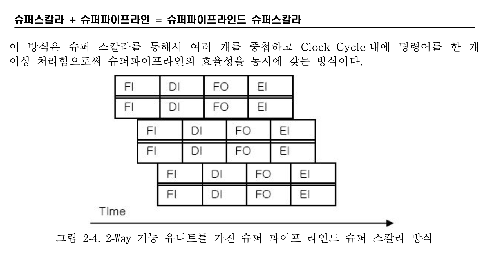
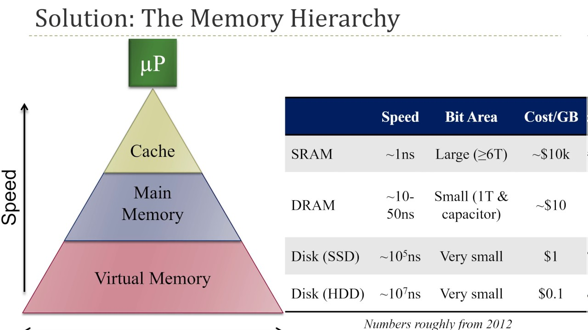
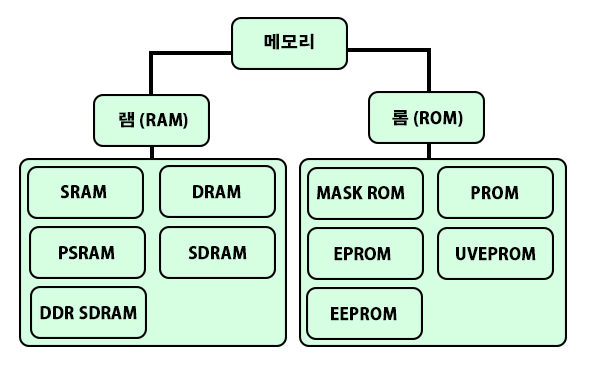
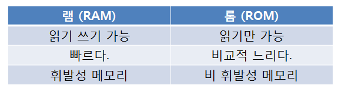
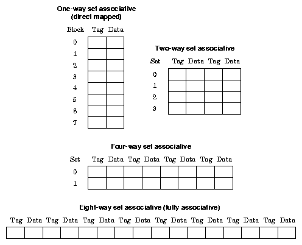

# 논리회로 / 컴퓨터구조

1. 아키텍쳐가 무엇인가
   (1) 시스템 아키텍처

   - 시스템 아키텍처란 시스템의 개념적 모형이다. 시스템의 목적을 달성하기 위해 각 구성 요소가 무엇이며 어떻게 상호작용하고 정보가 어떻게 교환되는 지를 계획하고 설명한다.
   - 시스템 전체(하드웨어와 소프트웨어를 포괄한 것)에 대한 논리적인 기능 체계와 그것을 실현하기 위한 구성 방식. 시스템의 전체적인 최적화를 목표로 하고 있다.

   (2) 컴퓨터 아키텍처 (컴퓨터 구조)

   * 컴퓨터 시스템의 기능(functionality), 조직(organization), 구현(implementation)에 대한 법칙과 방법
   * 컴퓨터 구조는 [명령어 집합 구조](https://ko.wikipedia.org/wiki/명령어_집합)(Instruction set architecture, ISA), [마이크로아키텍처](https://ko.wikipedia.org/wiki/마이크로아키텍처)(Microarchitecture) 설계, 논리 설계 및 구현
   
2. 폰 노이만과 하버드 아키텍쳐에 대해서 설명하시오

   

   - 폰 노이만 구조 : 
     - 이름 그대로 존 폰 노이만이 고안한 내장 메모리 순차처리 방식이다. 데이터 메모리와 프로그램 메모리가 구분되어 있지 않고 하나의 버스를 가지고 있는 구조를 말한다. 이 구조에서 CPU는 메모리로부터 명령을 읽고, 메모리로부터 데이터를 읽고 쓰기도 한다. 명령과 데이터는 같은 신호 버스와 메모리를 사용하기 때문에 동시에 접근하는 것은 불가능하다. (명령어를 읽을 때 데이터를 읽거나 쓸 수 없다.)
     - 폰 노이만 구조의 디지털 컴퓨터에서는 ‘저장된 프로그램’(stored-program)의 개념이 도입되었다. 이는 프로그램을 구성하는 명령어들을 임의 접근이 가능한 메모리상에 순차적으로 배열하고, 동시에 조건 분기를 무제한적으로 허용한다는 것을 뜻한다. 폰 노이만 구조에서는 같은 메모리 속에 실행코드와 데이터가 따로 구분되지 않고 함께 섞여 있다.
     - **폰 노이만 병목현상**
       - 내장 메모리 순차처리 방식으로, 데이터 메모리와 프로그램 메모리가 구분되어 있지 않고 하나의 버스를 가지고 있는 구조 때문에 CPU가 명령어와 데이터에 동시 접근할 수 없습니다. 이를 해결하고자 나타난 구조가 하버드 구조입니다.
       - 또한 메모리의 값을 읽고 쓰는 구조이기 때문에 기억장치에 병목현상이 생길 수 밖에 없습니다. 이를 해결하고자 나타난 기술에는 메모리 계층 구조나 NUMA, DMA 등이 있습니다.
   - 하버드 구조 :
     - 하버드 아키텍처(Harvard architecture)는 본래 명령용 버스와 데이터용 버스로 물리적으로 분할한 컴퓨터 아키텍처를 나타내는 용어입니다 (폰 노이만 구조와 대비시킨 용어이기도 합니다).
     - 폰노이만 구조에서는 CPU가 명령어와 데이터에 동시에 접근이 불가능해서 한번에 하나씩 처리할 수 없었던 반면에, 하버드 아키텍처의 컴퓨터에서는 명령을 메모리로부터 읽는 것과 데이터를 메모리로부터 읽는 것을 동시에 할 수 있습니다. 따라서 현재 명령의 처리를 끝내는 동시에 다음 명령을 읽어 들일 수 있어서 더 빠른 속도를 낼 수 있습니다.
     - 그렇지만 이러한 처리 속도를 높이려면 보다 많은 전기 회로가 필요합니다. 두개의 버스와 메모리를 가지게 되므로 CPU코어에서 공간을 많이 차지합니다.
   - 현대에 이르러서는 CPU의 외부적으로는 폰 노이만 구조를, 내부적으로는 하버드 구조를 적용하여 속도를 향상시킨 것이 많습니다. 그러나 이것 또한 폰노이만 구조를 기반으로 만들어진 것이기 때문에, 병목현상만 어느 정도 해결할 뿐 메모리 속의 프로그램을 순차적으로 실행하는 근본적인 구조 자체는 변하지 않습니다.

3. 데이터랑 명령어가 메모리를 공유하면 좋은 점이 무엇인가? 

   - 한개의 버스와 메모리를 가지므로 cpu 공간 차지가 적다, 또한 하버드 구조보다야 적은 회로가 필요하다.
   
4. 파이프라이닝이란?

   * 명령어를 순차적으로 실행하는 프로세서에 적용되는 기술로, 한 번에 하나의 명령어만 실행하는 것이 아닌 하나의 명령어가 실행되는 도중에 다른 명령어를 실행을 시작하는 식으로 동시에 여러 개의 명령어를 실행하는 기법
   * 동시에 여러개의 명령어를 처리하므로써 처리량을 올리는 것이지 각 명령어의 실행시간을 개선하지는 못한다.
   * 명령어를 세분화 할수록 처리 속도의 향상을 기대할 수 있지만, 실행할 명령 수에 비해 지나치게 단계를 세분화 하면 높은 효율성을 기대하기는 힘들다.

5. 슈퍼스칼라란?

   - 클록에 대한 throughput을 최대화하기 위해서 쓰입니다. 슈퍼 스칼라가 일반 파이프라이닝보다 더 많은 명령어를 처리할 수 있죠.
   - 슈퍼파이프라이닝은 파이프라이닝의 깊이를 증가시켜 더욱 많은 명령어를 중첩시키는 것, 슈퍼스칼라 파이프라이닝은 파이프라인을 여러 개 복제하여 사이클마다 다수의 명령어를 파이프라인에 투입하는 것.

   

6. 파이프라이닝을 단계를 늘리면 그만큼 빨라지는가?

   * 명령어를 세분화 할수록 처리 속도의 향상을 기대할 수 있지만, 실행할 명령 수에 비해 지나치게 단계를 세분화 하면 높은 효율성을 기대하기는 힘들다.

   * 해저드라는게 있는데 **스트럭쳐럴 해저드, 데이터 해저드, 컨트롤 해저드** 때문에 성능이 막 오르지는 않습니다.

7. 3가지 해저드를 각각 어떻게 해결하는가?

   * 구조적 해저드(Structural Hazard) : 프로세서의 자원이 부족해서 발생

     > 파이프라인에서 실행 중인 2개 이상의 명령어가 동일한 하드웨어 자원을 동시에 요구하기 때문에 파이프라인을 멈춰야 하는 상황

     | 클럭주기 | 1        | 2        | 3        | 4           | 5           | 6        | 7        |
     | -------- | -------- | -------- | -------- | ----------- | ----------- | -------- | -------- |
     | 명령어 1 | 가져오기 | 해석하기 | 실행하기 | 결과쓰기    |             |          |          |
     | 명령어 2 |          | 가져오기 | 해석하기 | 실행하기(1) | 실행하기(2) | 결과쓰기 |          |
     | 명령어 3 |          |          | 가져오기 | 해석하기    | 실행하기    | stall    | 결과쓰기 |
     | 명령어 4 |          |          |          | 가져오기    | stall       | 실행하기 | Stall    |

     위와 같이 명령어 2에서 실행하기가 한 클럭에 안 끝나는 경우, 명령어 3에서 결과쓰기를 수행할 때 멈춤(stall)이 발생한다.

     명령어 4에서는 해석하기 단계가 필요없는 명령어 이므로, 실행하기를 수행할 시 명령어 3에서 실행하기가 수행되고 있어 또한 멈춤이 발생한다.

     **해결 방안**: 충돌하는 자원을 추가로 제공하여 파이프라인을 재구성하거나, 예약표(Reservation table)을 이용하여 자원 충돌을 방지. 만약 레지스터 파일이나 메모리에서 충돌이 발생하면 읽기나 쓰기가 동시에 처리될 수 있도록 다중 포트화(multi-port)하거나 둘 이상으로 분할함으로써 구조적 해저드를 일부 해소

   * 데이터 해저드(Data Hazard) : **이전 명령어의 결과를 기반으로 다음 명령이 수행될 때 파이프라인이 지연되는 경우 생기는 것**으로, 컴퓨터 파이프라인에서는 앞선 명령어에 종속성을 가질 때 데이터 해저드가 일어난다.

     > 연산할 데이터가 준비되지 않아 파이프라인을 멈춰야 하는 모든 상황이나 조건, 주로 선행 명령어가 사용하는 데이터와 후행 명령어가 사용하는 데이터 사이의 종속 관계로 인해 발생하므로 데이터 종속이라고도 한다.

     **해결 방안**:  **전방전달(forwarding)** 혹은 **우회전달(bypassing)**

     - 이것은 별도의 하드웨어를 추가하여 정상적으로는 얻을 수 없는 값을 내부 자원으로부터 일찍 받아오는 것을 의미하는데, 레지스터나 메모리에 아직 나타나지 않은 데이터를 기다리지 않고 데이터패스를 추가로 하드웨어에 연결하여 내부 버퍼로 부터 가져오는 것이다.(전방전달)-> 예로 쓰기 후 읽기 (RAW) 의 경우 ALU 에서 연산 완료된 값이 $1에 저장이 되는데 이를 바로 다음 명령어에서 읽고 사용해야 하는 경우, write 전에 ALU 에서 연산 완료된 값을 가지고 오는 것

     - 결과를 생성하는 파이프의 출력과 결과를 사용하는 파이프의 입력을 연결하는 별도의 경로를 추가하면 되는데, 이와같은 기법을 전방 전달 / 컴파일러의 도움으로 적재 명령어의 결과와 무관한 명령어의 순서를 바꾸는 기법을 지연적재라고 한다.

   * 제어 해저드(Controll Hazard) : 명령어의 실행 순서를 변경하는 Branch , Jump 등 **분기 명령어들로 인해 다른 명령어들이 실행 중에 한 명령어의 결과 값에 기반을 둔 결정을 할 필요**가 있을 때 일어난다.

     > 행할 명령어가 결정되지 않았거나 준비되지 않아서 파이프라인을 멈춰야하는 상황이나 조건

     | 클럭주기 | 1        | 2        | 3        | 4        | 5        | 6        | 7        |
     | -------- | -------- | -------- | -------- | -------- | -------- | -------- | -------- |
     | 명령어 1 | 가져오기 | 해석하기 | 실행하기 | 결과쓰기 |          |          |          |
     | 명령어 2 |          | stall    | Stall    | 가져오기 | 해석하기 | 실행하기 | 결과쓰기 |

     **해결 방안** :

     - Delayed Decision : 손실되는 클럭 동안 프로그램에 영향이 없는 다른 명령어 실행
     - Predict Taken / Not Taken : 명령어 분기를 예측하여 명령어 수행 / 명령어 분기 시 명령 취소 
     - Stall : 분기 방향이 결정될 때 까지 지연

   * 파이프라인 해저드는 해저드의 원인이 사라질 때까지 파이프라인에의 명령어 투입을 멈춰야 하는데 이를 파이프라인 중지(pipeline stall) 또는 파이프라인 버블 이라고 한다. 파이프라인 버블이 많아지면 성능향상에 방해가 되기 때문에 이를 위한 다양한 해결책이 필요하다. 소프트웨어적으로는 컴파일러의 도움으로 명령어의 순서를 변경하는 방법이 있고, 하드웨어적으로는 파이프라인을 다시 설계하거나 하드웨어 자원을 추가함으로써 파이프라인 버블을 해결할 수 있다.
     

8. 메모리 계층구조 (memory hierarchy)

   

   S-RAM, D-RAM 과 같이 비싸고 빠르고 휘발성이 높은 메모리는 중앙처리장치에 가까이 배치하고, HDD나 Flash 메모리 같이 느리고 값싼 비휘발성 메모리는 큰 데이터를 오래도록 저장하는데 주로 사용됩니다.
   

   - 메모리 반도체는 읽고(Read) 쓸 수(Write) 있는 램(RAM, Random Access Memory) 제품과 읽기만 할 수 있는 롬(ROM, Read Only Memory) 제품으로 구분됩니다.

     - 램(RAM)은 전원이 꺼지면 기억된 내용은 지워져 휘발성 메모리(Volatile Memory)라고 하며, 컴퓨터의 주기억 장치, 응용프로그램의 일시적 로딩(Loading), 데이터의 일시적 저장 등에 사용됩니다.

       **- SRAM (Static RAM)**
       정적램이라 표현하며, DRAM에 비해 용량은 적으나 5배 정도 속도가 빠르고, 가격이 비쌉니다. 

       **- DRAM (Dynamic RAM)**
       동적램이라 표현하며, SRAM에 비해 용량은 크지만 속도가 느리며, 비교적 가격이 저렴합니다. 저장공간마다 캐패시터(전기 저장)를 사용하기 때문에 전원이 연결된 상태로 시간이 흘러 캐패시터에 있는 전기가 누설될 경우 데이터가 유실될 수 있습니다.

       **- PSRAM (Pseudo SRAM)**
       내부에 전하 충전회로를 내장하여 DRAM의 단점을 보완한 RAM입니다. 주기적으로 전하충전이 되기 때문에 데이터 유실을 막을 수 있으며, SRAM처럼 사용할 수 있습니다. 

       **- SDRAM (Synchronous DRAM)**
       100MHz 이상의 버스 속도를 유지하는 기능을 개발하여 내장한 DRAM의 일종입니다. 시스템의 클럭속도(보통은 CPU의 속도)와 동기화하여 동작할 수 있기때문에 CPU가 동작할 때 DRAM도 함께 움직여 CPU가 수행할 수 있는 명령어를 증가시킴으로써 최고의 효율로 작동시킬 수 있습니다.

       **- DDR SDRAM (Double Data Rate SDRAM)**
       SDRAM보다 처리속도가 2배 빠른 RAM입니다. 시스템버스 클럭의 Rising edge와 Falling edge를 동작시켜 같은 속도, 같은 시간내에 2배의 데이터를 보낼 수 있습니다. 즉, 100MHz로 작동하는 DDR SDRAM은 200MHz로 작동하는 SDRAM과 같습니다.

     - 롬(ROM)은 전원이 꺼져도 Data가 지워지지 않는 비휘발성 메모리로 대표적 으로 입출력 시스템이나 IC카드 등에 사용됩니다.  일반적인 롬은 데이터를 한번 저장하면 지울 수 없이 계속 사용해야하지만, PROM(1번 다시 쓰기가능), EPROM(무한), EEPROM(무한)은 특수한 방법을 통해 데이터를 삭제한 후 데이터를 다시 기록할 수 있습니다.
       **- MASK ROM**
       가장 기본적인 ROM으로써, 제조사가 ROM 제조시에 데이터를 미리 저장해둡니다. 저장된 데이터는 변경할 수 없습니다.

       **- PROM (Programmable ROM)**
       저장된 데이터를 지우고 1회 수정할 수 있는 ROM입니다. 모든 저장공간에 퓨즈가 연결되어있으며, 데이터를 기록할 경우 퓨즈가 끊겨 데이터 수정이 불가능해집니다.

       **- EPROM (Erasable PROM)**
       메모리에 저장된 데이터를 지우고, 다시 저장할 수 있는 ROM입니다. 데이터를 지우는 방식에 따라 UVEPROM과 EEPROM으로 분류합니다.

       **- UVEPROM (Ultra-Violet EPROM)**
       자외선을 사용하여 저장된 데이터를 지울 수 있는 ROM입니다.

       **- EEPROM (Electrically Erasable PROM)**
       전기적인 기능을 통해 저장된 데이터를 지울 수 있는 ROM입니다. 정격전압보다 높은 고전앞을 통해 데이터를 지울 수 있으며, 1바이트씩 데이터를 지우기 때문에 속도가 매우 느린편입니다. 
       

   

   

9. 캐시를 사용하는 이유는?

   캐시는 메모리와 프로세서 사이에 있는 메모리 계층으로, CPU 와 주기억장치의 속도 차이로 인한 CPU의 대기 시간을 최소화 시키기 위하여 둘 사이에 설치하는 고속 반도체 메모리 이다. 주기억장치보다 엑세스 속도가 빠른 칩을 사용하지만 가격 및 제한된 공간 때문에 용량이 작다. (캐시는 반응 속도가 빠른 SRAM <-> 메인 메모리는 DRAM)

   * 캐시 hit : CPU가 원하는 데이터가 캐시에 있는 상태
   * 캐시 Miss : CPU가 원하는 데이터가 캐시에 없는 상태 -> 주기억 장치로 부터 데이터를 읽어온다.
   * 캐시의 적중률은 프로그램과 데이터의 지역성(locality)에 따라 달라짐
   * 용량이 커질수록 적중률이 높아지지만 비용이 증가하고, 주소 해독 및 정보 인출을 위한 주변 회로가 더 복잡해져 접근 시간이 다소 길어진다.
     

10. 캐시 메모리의 쓰기 정책

    * Write Through

      * 프로세서에서 메모리에 쓰기 요청을 할 때마다 캐시의 내용과 메인 메모리의 내용을 같이 바꾸는 방식
      * 이 방식은 쓰기 요청 마다 메인 메모리에 접근해야 하므로 쓰기 시의 접근 시간은 주 메모리의 접근 시간과 같게 되는 단점이 있다.
      * 하지만 실제 프로그램에서 메모리 참조 시 쓰기에 대한 작업은 통계적으로 적어서 구조가 단순하고, 메모리와 캐시의 데이터를 동일하게 유지하는데 별도의 신경을 쓰지 않아도 되므로 많이 사용되는 방식

    * Write Back

      * CPU 에서 메모리에 대한 쓰기 요청 시 캐시에만 쓰기 작업을 하고 그 변경 사실을 나타내는 표시를 하여 놓은 후 캐시로부터 해당 블록의 내용이 제거될 때 그 블록을 메인 메모리에 복사함으로써 메인 메모리와 캐시의 내용을 동일하게 유지하는 방식
      * 동일한 블록 내에 여러 번 쓰기를 실행하는 경우 캐시에만 여러 번 쓰기를 하고 메인 메모리에는 한 번만 쓰게 되므로 이런 경우에 매우 효율적으로 동작하지만 구성 방법이 복잡한 편이다.

      

11. 캐시를 구현하는 방법들은?

    CPU가 메모리 주소를 요청하여 데이터를 받을때, CPU가 쓰는 주소는 논리 주소 즉, 가상메모리 주소이므로 메모리의 물리적 주소로 변환이 필요하다. 이때 MMU가 이를 전환하는데 그 전환된 주소에 대한 데이터가 캐시에 있는지를 먼저 확인해야 한다. 이 과정에서 캐시에 데이터가 있는지를 확인하는 방법 및 할당 방식으로 mapping을 진행한다.

    일단, 캐시로 데이터를 저장할 때 spatial locality를 고려하여 인접한 곳까지 한꺼번에 저장하는데 이 단위를 block이라고 하고, 캐쉬는 메인 메모리의 몇번째 블록인지를 알려주는 태그(Tag)도 함께 저장한다.

    * **direct mapping**

      * main memory 주소당 캐시의 자리는 딱 1곳으로 정해지는 방식
      * Cache 사이즈에 따라 캐시의 위치를 modulo방식을 이용해 배정하는데, 각 캐시 위치에서 정확한 메모리 위치의 대응성을 위해 tag를 사용한다.
      * 즉, 00001, 01001, 11001 은 모두 캐시의 001에 매핑 되지만 태그는 각각 00,01,11로 다르므로 hit 판정이 가능하다. -> 각 블록 안에서 n번째 주소는 캐쉬의 n번째 라인에(index) 저장이 되고 몇번째 블록인지가 tag에 저장되는 방식
      * 인덱스가 가리키는 공간이 하나인 경우, 처리가 빠르지만 충돌이 잦다.

    * **fully associative**

      * 서로 다른 두 주소가 같은 인덱스를 가지면 충돌이 발생하고 블록을 교체하는데 이러면 미스가 늘어나고 한 자리의 내용을 끝없이 바꾸는 핑퐁 문제가 일어날 수 있다.
      * 인덱스가 모든 공간을 가리키는 경우, 충돌이 적지만 모든 블록을 탐색해야 해서 속도가 느리다. -> 그냥 아무데나 놓는 느낌?

    * **N-way set associative**

      * 캐쉬의 하나의 인덱스 자리에 하나의 block이 아닌 블락의 집합(set)이 들어가는 매핑법
      * 인덱스가 가리키는 공간이 두 개 이상인 경우
      * 2-way 인 경우, 한 인덱스에 두개의 way(tag)가 있기 때문에 두개의 tag를 비교해야 한다.
      * direct mapping보다 hit를 판단하는 Latency가 늘었지만 충돌 가능성을 줄였다.
      
      > N이 1이면 direct mapping이고 N이 커질수록 fully associative와 비슷
      
      
      
      

    

12. 캐시 메모리의 교체 알고리즘

    * FIFO (First In First Out)
      * 먼저 저장되어 있던 블록이 먼저 나가는 방식
    * LRU (Least Recently Used)
      * 사용되지 않은 채로 가장 오래 있었던 블록이 나가는 방식 (가장 효과적인 방법)
    * LFU (Least Frequently Used)
      * 사용빈도수가 가장 적은 블록이 나가는 방식 (각 슬롯에 카운터를 설치)
    * Random
      * 한 슬롯을 임의로 선택해서 제거
    * Optimal
      * 미래에 가장 참조되지 않은 블록 제거 (실현 불가능)

    
    
13. locality에는 어떤게 있지?

    * 시간적 지역성(최근), 공간적 지역성(기억장치내 인접 데이터들), 순차적 지역성(명령어 순차)

      > 로컬리티 사용하는 걸로 가상 메모리와 캐시가 있는데 둘의 차이는?
      >
      > 가상 메모리는 물리적 메모리를 더 크게 사용하기 위한 것이고, 이를 위해 HDD까지 메모리 영역을 확장하는데 여기서 실제 물리 주소에 어떤 거를 올려놓느냐에 로컬리티를 사용
      >
      > 캐시는 CPU와 메모리 사이의 속도차를 극복하기 위해 고안되었으며, 따라서 더 자주 쓰일 만한 데이터를 캐시에 올려놓는 과정에서 로컬리티를 이용한다.
      
      

14. 멀티 코어 프로세스하고 멀티 쓰레드 프로세스 알아? 그러면 캐시는 어떻게 해?

    - 캐시는 두 코어가 공유하는게 있고 각각이 또 따로 가지고 있습니다.
    - 멀티 코어 프로세스는 core 가 2개 이상인 경우 동시에 여러 개의 프로세스를 처리하는 것입니다.
    - 멀티 쓰레드 프로세스는 한개의 프로세스 내에서 여러 개의 스레드를 가지고 일을 수행하는 것입니다. 이 스레드들이 모여 하나의 프로세스를 이룹니다. 즉, 하나의 작업을 여러개의 sub task로 분할해서 동시간에 실행되는 것처럼 수행하는 기법입니다.
      
    
15. 페이징 기법과 가상 메모리(virtual memory)

    > 가상 메모리 : 물리적 메모리보다 많은 메모리를 프로그램에서 사용할 수 있도록 디스크의 일부를 메모리처럼 사용하는 논리적 메모리
    >
    > 무조건 물리적 메모리를 늘려서 효율을 늘리는 것은 비용대비 한계가 있어 해당 방법을 이용한다.

    - 실제로 필요한 메모리 ex) 2GB > 메인 메모리 저장 용량(RAM) ex) 250MB 이런 경우 Hard Disk 를 이용해서 넘치는 부분을 채우자 -> 하드 디스크 까지 메인 메모리의 영역을 확장해서 넓히는 개념

    - 가상 주소(virtual address)(=논리적 주소)는 실제 메모리 주소가 아닌 가상 메모리 영역을 가리키는 주로를 말하며 선 할당된 부분에 대한 부담과 느린 속도에 대한 개선을 한다. 이때, 물리적 주소와 논리적 주소 사이에 상호 변환이 가능해야 한다. 변환이 가능한 테이블을 운영체제가 제공해준다.

    - 과정 : CPU 는 physical mem + virtual mem 이 합쳐진 범위의 주소(page) 할당 요청이 가능한데, 실제 물리 메모리는 이것보다 작으니까 이를, MMU가 CPU 가 요청한 메모리 주소를 실제 물리 메모리 주소(page frame)로 변환하여 찾아준다. 
      즉, 메인 메모리 공간이 4K블록씩 4개 -> 16KB 일때, 가상 메모리까지 해서 2GB라고 하면 CPU가 요청 가능한 주소 범위는 0~2G-1 이다. 여기서 CPU가 처음에 1k 번지 부터 20바이트 할당 요청 하면, MMU가 이를 변환하여 메인 메모리 첫번째 블럭을 0-4k로 할당한다. 두번째로 CPU가 36k부터 20바이트 할당 요청 하면 MMU가 이를 변환하여 두번째 블록을 원래는 4K-8K 부분이지만 36K-40K로 할당을 한다.
      
    - 마치 캐시와 RAM과의 관계처럼 RAM 과 HDD의 관계가 이뤄져 있다고 생각하면 쉽다. HDD 에 저장된 데이터 -> 스왑 파일

      

    > 페이징 기법 : 물리적 메모리에 데이터를 체계적으로 적재하기 위해서 일정한 크기로 나누어 저장/로드를 하는 것, 이 때의 기준이 되는 하나의 블록을 page 라고 한다. 가상 메모리에서는 페이지라고 한다.
    >
    > * 캐쉬의 경우 접근 단위를 블록 또는 프레임으로 표현하고 가상 메모리의 경우는 페이지 라고 한다.

    * 고전적 방식은 프로그램을 수행하기 위해 프로그램의 일부를 실제 메모리에 올리고 그 올라와 있는 영역의 명령어를 CPU가 순차적으로 수행해야 한다. 이때, 프로그램의 일부가 메모리가 올라가 있어서 이를 프로세스라고 한다. 이런 식으로 진행하면 대신 다른 프로그램이 수행되려고 하면 이 전체 메모리를 다시 내려하는 상황이 나타난다. Context Switching 과 함께 이전 프로그램의 메모리가 내려가고 다른 프로그램이 메모리에 일부 적재되는 작업이 반복되는 것은 비효율적이다. 이런 방법에서 점차 진화하는 것이 메모리 효율적 사용을 위한 방안으로 '페이징 기법' 이라는 것이다.
    * 페이징 기법은 프로그램을 메모리에 적재할 때 균일하게 나눠서 페이지 단위로 올리는 방식이다. 메모리는 지역성을 지니기에 프로그램의 일부를 올리면 메모리에서 효과적으로 사용하다가 내려올 수 있고, 또 다른 프로그램의 일부도 동시에 메모리를 사용할 수 있다는 장점이 있다.

16. 페이지 테이블은 어디에 있는가?

    프로세스는 독립적인 메모리 공간을 차지하며, 시스템은 프로세스가 자신의 영역 외에는 접근할 수 없도록 막아야 한다. 프로그램을 실행하기 위해서는 메모리에 로드해 프로세스로 만들어야 한다. 이때 디스크에서 메인 메모리로 로드되기를 대기하는 곳이 input queue이다. 운영체제는 input queue에서 프로세스를 선택해 메모리에 로드한다.

    MMU는 TLB라는 캐시를 저장하고 있다. 가상주소가 물리 주소로 변환되어야할 때, TLB에서 우선 검색된다.

    해당 되는 주소가 있으면 (TLB hit) 물리주소가 리턴되고 메모리에 접근한다. 하지만, TLB에서 해당되는 주소가 없을 경우 (TLB miss) 페이지테이블에서 맵핑이 존재하는지 찾는다. 존재할 경우에 (page table hit) 이 값은 다시 TLB에 쓰이고 그 주소를 갖고 물리 주소로 변환 후, 메모리에 접근한다.

    페이지 테이블에서도 찾지 못할 경우에는 disk에서 찾게 되고 그 값을 다시 page table에 쓰이고 TLB에 쓰이고 물리주소로 변환 후 메모리에 접근한다.

    다시 정리하면, 가상 주소를 갖고 물리 주소에 접근할 때 TLB -> page table -> disk 순으로 접근한다고 생각하면 된다.

    **TLB는 processor 안에 있으며 page table에 경우 주로 메모리에 있으나 운영체제마다 다르다.**

17. 페이지 테이블에 접근하는 시간을 줄이기 위해 어떻게 하는가? TLB (16번 참고)

18. 페이지 폴트나면 어떻게 하는가? Disk 에서 값을 찾고 그 값을 다시 page table에 쓰고 TLB에 쓰이고 물리주소 변환 후 메모리에 접근 (16번 참고)

19. page fault 나면 page replacement 할 때 기억해야 되는 정보들이 뭐냐 그냥 바꿔주면 되는가?

    페이지 교체 알고리즘에 따라 다르다. 

    - FIFO -> 메모리에 올라온 지 가장 오래된 페이지를 교체한다. 이를 위해 각 페이지가 올라온 시간을 페이지에 기록하거나 페이지가 올라온 순서를 큐에 저장하는 방식을 이용한다.
    - Optimal (가장 오랫동안 사용되지 않을 것을 교체) -> 프로세스가 앞으로 사용할 페이지를 미리 알아야 한다 -> 아직 구현이 불가능 
    - LRU(가장 오래 사용되지 않은 것을 교체) -> 가장 오랫동안 사용되지 않은 페이지를 교체하는 것이니까 이를 판단할 수 있는 어떤 시그널을 기억해야 한다. 예로, 처음에 쓰일 때 1로 하고 그 다음 다른 게 쓰이면 +1 씩 하고, 제일 숫자가 큰거를 빼는 것 같이, 이를 참조 비트(Reference Bit)로 페이지 테이블에서 제공하기도 한다.
    - LFU (참조 횟수가 가장 적은 페이지를 교체) -> 이거는, 초기에 한 페이지 집중 참조하다가 이후 다시 참조하지 않는 경우 문제 가능성 존재 ->그때만 쓰고 계속 안쓰는데 교체가 안되니까
    - MFU (참조 횟수가 가장 많은 페이지를 교체) -> 참조 횟수가 적은 페이지가 최근에 사용된 것이라는 가정에 나온 알고리즘 
    - LFU 와 MFU는 실제 사용에 잘 쓰이지 않는다.

20. page 와 segmentation 각각의 장단점을 비교해서 설명해보시오.

    * 페이징(paging)이 고정된 영역인 페이지(page)로 분할

      * **페이징: 내부 단편화 O, 외부 단편화 X**
        -> 고정된 페이징 크기보다 적은 양의 메모리만 필요한 경우

      * 물리메모리를 사용할 때, 페이지를 고정크기의 프레임단위로 나눕니다.

        **논리메모리도 같은 프레임단위인 페이지로 나누어 프레임과 페이지를 대응하게 하여 연속적인 물리메모리가 아니더라도 원하는 크기의 프레임을 사용할 수 있도록 하는 기능입니다.** 

        * 프레임(Frame) : 물리 메모리를 일정한 크기로 나눈 블록

        * 페이지(Page) : 가상 메모리를 일정한 크기로 나눈 블록

      * 페이징 기법을 사용하면 연속적이지 않은 공간도 활용할 수 있기 때문에 외부단편화(External fragmentation)을 해결할 수 있고, 코드를 쉽게 공유할 수 있다는 장점이 있습니다. 그리고 페이지 단위를 작게하면 내부 단편화(Internal fragmentation) 역시 해결할 수 있지만(페이지에 공간을 할당한 후, 남는 공간이 적어지기 때문에) 그 만큼, page mapping 과정이 증가하므로 서로  **trade off 관계**에 있습니다.

    * 세그먼테이션은 가변적인 영역인 세그먼트(segment)로 분할함

      * **세그먼테이션:** **내부 단편화 X, 외부 단편화 O**

        -> 메모리에 총 남은 공간은 넉넉하지만 한 세그먼트 덩어리가 들어갈 수 있는 연속된 영역이 없는 경우

      * **세그먼테이션 역시 평균 세그먼트 크기가 작을수록 외부 단편화 작음**

        메모리 압축 기법이나 동적 대치 알고리즘을 활용하여 외부 단편화 최소화 가능

      * 페이징 기법에서는 가상메모리를 같은 크기의 단위로 분할했으나 세크멘테이션 기법에서는 가상메모리를 서로 크기가 다른 논리적 단위인 세그먼트(Segment)로 분할하고 메모리를 할당하며 주소 변환을 하게 됩니다. (각각의 세그먼트들은 연속적인 공간에 저장되어있습니다)

      * **세그먼트들의 크기가 서로 다르기 때문에 메모리를 페이징 기법처럼 미리 분할해 둘 수 없고,**메모리에 적재될 때 빈 공간을 찾아 할당하는 사용자 관점의 가상메모리 관리 기법입니다.

      * 페이징기법과 마찬가지로 mapping을 위해 세그먼트 테이블을 필요로 합니다. 이 기법은 하나의 세그먼트 단위로 통제가 가능한 장점이 있습니다. 즉 내부단편화가 발생하지 않습니다. 그러나 서로 다른 크기의 세그먼트들에 대해 필요시에 메모리에 올리고 필요없을 경우 내리는 작업을 반복하다보면 외부 단편화가 생기는 문제점이 있습니다.
        

21. Thrashing 이란?

    * 메모리 페이지 할당이 너무 적어서 실제 프로세스가 원하는 명령어의 실행 시간보다 페이지 fault 로 인한 페이지 교체 수행의 시간이 더 많아진다면 수행보다 교체가 많아서 컴퓨터의 성능 저하가 나타나는데 이를 Thrashing이 발생했다고 한다.
    * 높은 우선 순위의 인터럽트가 많이 발생하게 되면 정상적인 프로세스를 밀어내게 되는데, 이러한 때에 발생되기도 한다.
    * 프로세스의 갯수가 증가할수록 각각의 프로세스가 가질 수 있는 메모리 페이지 개수는 줄어들어 이는 곧 더 많은 페이지 교체의 발생을 의미하며 이는 CPU가 어떠한 작업을 처리하는 시간보다 페이지 교체를 위한 디스크 I/O 작업을 기다리는데 소비하는 시간이 더 많아 발생하기도 한다. 이를 막기 위해 운영체제는 프로세스가 가져야 하는 페이지의 수를 적절히 조절해 주어야 한다.

    

22. Working Set의 정의

    * Locality 모델을 기반으로 하여 특정 시간에 실행되는 프로그램에 최근 참조했던 페이지들의 집합을 Working Set이라고 한다. ( 하나의 프로세스에서 메인 메모리에 올라갈 수 있는 페이지들의 양 )
    * 프로그램이 효과적으로 실행되기 위해서는 활동 프로세스의 working set이 메모리에 적재되어 있어야 한다. 프로세스가 진행하는 동안 working set은 계속 변화한다.
    * working set 크기 결정 방법
      * 고정 크기 할당 정책 : 프로세스가 생성되어질 때 메인 메모리에 유지할 페이지수를 결정하게 되며 그 이후 크기를 계속 유지하는 것, 추가적인 페이지가 필요할 때에는 페이지의 교체를 수행해야 한다.
      * 가변 크기 할당 정책 : 프로세스가 실행되는 동안 페이지의 할당 수를 다르게 하는 것으로, 페이지 부재가 자주 발생하는 프로세스의 경우 그 페이지의 할당 수를 늘려줌으로써 페이지 부재를 줄여주고, 적게 발생하는 경우 그 할당 페이지 크기를 줄여줌으로써 다른 프로세스가 사용할 수 있는 메인 메모리의 페이지 수를 늘려줄 수 있게 하는 것이다. 이는 운영체제가 활동 중인 프로세스에 대하여 모니터링해야 하므로 많은 오버헤드를 초래하게 된다.
        

23. 밀리머신과 무어머신의 차이
    - 밀리 : 출력이 상태와 입력에 따라 다름
    - 무어 : 출력이 상태의 따라 다름

24. 논리식 간소화 방법 (카르노맵)
    

25. 메모리를 기억하는 소자에는 무엇이 있나?

    * S-RAM : 스위치를 켜거나 꺼서 0/1을 저장한 후, 필요할 때 스위치 상태를 읽을 수 있는 장치, 각 트랜지스터들의 동작상태를 유지하는데 전력이 소모되는 관계로 에너지적으로도 비싼 메모리, 그 속도가 엄청나게 빠름

    * D-RAM : Dynamic RAM 이라고 불리는 이유는 축전기에 저장된 전자들이 시간이 지나면 스르르 빠져나가기 때문에, 특정 시간 (1/100~1/10초 정도)에 한번씩 메모리에 저장된 내용을 다시 적어줘야 합니다. 이를 메모리를 리프레시(Refresh) 한다. 중앙연산장치에 직접 연결되어 데이터를 주고 받는 메모리로 쓰일 수 있는 것입니다. 요즘의 랩탑이나 데스크탑의 ‘메모리용량’이라고 하면 보통 이 DRAM의 용량을 말하며, 4~32GB 정도가 개인용 컴퓨터에 주로 사용되는 용량

      > S-RAM과 D-RAM은 전기 신호 자체가 0과 1을 구분하는데 사용되기 때문에, 전력 공급이 중단되면 더 이상 데이터가 날아가 버립니다. 휘발성이 높은 메모리

    * Magnetic HDD: 자석의 원리를 이용해서, 데이터를 쓰고 지우는 Magnetic HDD입니다. 우리가 하드디스크로 알고 있는 아래 사진이 그 일반적 형태입니다.

      > 자석들은 한 번 N극, S극이 정해지면 오랜 시간동안 그 성질을 유지하기 때문에 컴퓨터가 꺼져도 데이터를 그대로 유지할 수 있습니다. 비휘발성

    * NAND-Flash: NAND 플래시 메모리에 대해서 알아보겠습니다. 플래시 메모리는 USB나 SSD 등에서 데이터를 저장하는 용도로 사용
      

26. Ripple Carry Adder와 Carry Lookahead Adder 에 대해 설명해보고 둘간의 tradeoff를 간략히 설명해보시오.
    

27. 고정 소수점(Fixed Point) 와 부동 소수점(Floating Point)에 대해 설명해보시오.

    * 고정 소수점은 소수점이 찍힐 위치를 미리 정해놓고 소수를 표현하는 방식이다 예를 들어 총 32 비트의 표현에서 1비트는 부호를 15비트는 정수를 나머지 16비트는 소수를 표현하는 방식이다. 이는 표현이 단순하나 표현의 범위가 적어서 활용하기가 어려운 방식이다.
      

    * 부동 소수점은 실수를 가수부, 지수부로 나눠  표현한다. 가수는 실수의 실제값을 표현하고 지수는 가수의 어디쯤에 소수점이 있는지를 나타내는 방식이다. 이는 표현할 수 있는 범위가 넓어지는 장점이 있고, 오차가 발생할 수 있다는 단점이 있다.
      

      

28. ARM (Advanced RISC Machine) 이란?

    > RISC : Reduced Instruction Set Computing (감소된 명령 집합 컴퓨팅)
    >
    > ARM 은 단순한 명령 집합을 가진 프로세서가 복잡한 명령 집합을 가진 프로세서보다 훨씬 더 효율적일 것이라는 생각에서 탄생하였다.

    * ARM 은 칩의 기본 설계 구조만 만들고, 실제 기능 추가나 최적화 부분은 개별 반도체 제조사의 영역으로 맡긴다. 따라서 물리적 설계는 같아도, 명령 집합이 모두 다르기 때문에 서로 다른 칩이 되기도 하는 것이다.
    * ARM은 RISC 설계 기반으로 명령 집합과 구조 자체가 단순해서 프로세서가 더 작고 효율적이머 상대적으로 느리다. 즉, 적은 수의 트랜지스터만 필요하므로 간결한 설계와 더 작은 크기를 가능하게 한다. 
    * ARM을 위해 설계된 프로세서는 오직 ARM 프로세서가 탑재된 기기에서만 실행할 수 있다. 따라서 ARM에서 실행되던 프로그램을 x86 프로세서에서 실행되도록 하려면 프로그램 수정이 가해져야 한다. 하지만, 하나의 ARM기기에서 동작하는 OS는 다른 ARM 기반 기기에서도 잘 동작한다. 

# 출처

7. https://happy-coding-day.tistory.com/49 , https://jokerkwu.tistory.com/120, http://blog.skby.net/%ED%8C%8C%EC%9D%B4%ED%94%84%EB%9D%BC%EC%9D%B8-%ED%95%B4%EC%A0%80%EB%93%9C-%EB%B0%8F-%ED%95%B4%EA%B2%B0%EB%B0%A9%EC%95%88/

8. https://www.youtube.com/watch?v=p1CTX5L_loc

13. https://about-myeong.tistory.com/35

10. https://steemit.com/kr-science/@doctoreecs/5tmffh

    https://parksb.github.io/article/29.html
