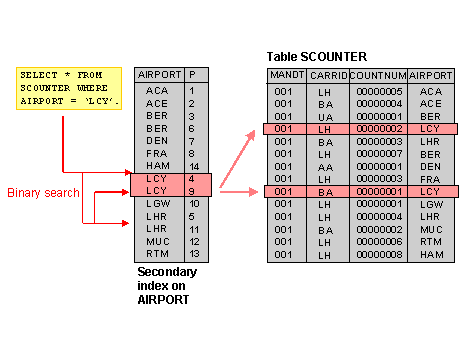

# 데이터 베이스

1. Key

   > Key ? 검색, 정렬시 tuple을 구분할 수 있는 기준이 되는 특성

   * Primary Key (기본키)
     * 후보키 중 선택한 main key
     * null 값을 가질 수 없음
     * 동일한 값이 중복될 수 없음
   * Candidate Key (후보키)
     * Tuple을 유일하게 식별하기 위해 사용하는 속성들의 부분 집합 (기본키로 사용할 수 있는 속성들)
     * 유일성 - Key로 하나의 Tuple을 유일하게 식별할 수 있음
     * 최소성 - 꼭 필요한 속성으로만 구성
   * Alternate Key (대체키)
     * 후보키 중 기본키를 제외한 나머지 키 = 보조키
   * Super Key (슈퍼키)
     * 유일성은 만족하지만, 최소성은 만족하지 못하는 키

   

2. Join

   > 두 개 이상의 테이블이나 데이터베이스를 연결하여 데이터를 검색하는 방법

   * 종류

     * INNER JOIN : 교집합 (완벽히 중복된 값이 있어 연결할 수 있는 거만 남겨두기)

     * LEFT OUTER JOIN : 기준 테이블(왼쪽) 기준으로 JOIN (기준 테이블에서 조인 테이블과 붙여질 수 없는 행이 있으면 그 행도 남겨두기)

     * RIGHT OUTER JOIN : 조인 테이블(오른쪽) 기준으로 JOIN (조인 테이블에서 기본 테이블과 붙여질 수 없는 행이 있으면 그 행도 남겨두기)

     * FULL OUTER JOIN : 합집합 (연결이 안되는 것도 다 남겨두기)

     * CLOSS JOIN : 모든 경우의 수를 전부 표현해주는 방식

       > A가 3개 행, B가 4개의 행을 가지고 있으면 총 3*4 = 12 개의 행이 검색됨

     * SELF JOIN : 자기자신과 자기자신을 JOIN 하는 것, 자신이 갖고 있는 칼럼을 다양하게 변형시켜 활용할 때 자주 사용

   

3. Anomaly

   > 정규화를 하는 이유는 잘못된 테이블 설계로 인해 Anomaly (이상 현상) 가 나타나기 때문이다.

   예시 데이터 베이스 : {Student ID, Course ID, Department, Course ID, Grade}

   * **삽입 이상 (Insertion Anomaly)**
     * 불필요한 데이터를 추가해야지만 데이터 베이스에 삽입할 수 있는 상황
       * 예시 : 기본키가 {Student ID, Course ID} 인 경우
         * Course 를 수강하지 않은 학생은 Course ID 가 없는 현상이 발생
         * 결국, Course ID를 Null 로 할 수 밖에 없는데, 기본키는 Null이 될 수 없어서 Table에 추가될 수가 없음
         * 삽입하기 위해서는 굳이 '미수강'과 같은 Course ID를 만들어야 함
   * **갱신 이상 (Update Anomaly)**
     * 일부만 변경하여 데이티가 불일치 하는 모순의 문제
       * 예시 : 어떤 학생의 전공 (Department) 이 '컴퓨터' 에서 '음악'으로 바뀌는 경우
         * 해당 학생의 모든 Department 를 '음악'으로 바꾸어야 함, 그러나 일부를 깜빡하고 바꾸지 못하는 경우 문제가 생김
   * **삭제 이상 (Deletion Anomaly)**
     * 튜플 삭제로 인해 꼭 필요한 데이터까지 함께 삭제되는 문제
       * 예시 : 만약 어떤 학생이 수강을 철회하는 경우  {Student ID, Course ID, Department, Course ID, Grade}의 정보 중 Student ID, Department와 같은 학생에 대한 정보도 함께 삭제됨
   
4. DB Index

   > 목적 : RDBMS 에서 검색 속도를 높이기 위한 기술
   >
   > Table 의 Column을 색인화 함 (따로 파일로 저장)
   >
   > * 해당 Table 의 Record를 Full scan 하지 않음
   >
   > * 색인화된 (B+ Tree 구조) Index  파일 검색으로 검색 속도 향상

   

   * 과정
     * Table 을 생성하면, MYD & MYI & FRM 3개의 파일이 생성됨
       * FRM : 테이블 구조가 저장되어 있는 파일
       * MYD :  실제 데이터가 있는 파일
       * MYI : Index 정보가 들어가 있는 파일
     * Index 를 사용하지 않는 경우, MYI 파일은 비어져 있음, 그러나 인덱싱하는 경우 MYI 파일이 생성됨
     * 이후에 사용자가 Select 쿼리로 Index를 사용하는 Column을 탐색시, MYI 파일의 내용을 검색
   * 단점
     * index 생성시 .mdb 파일 크기가 증가
     * 한 페이지를 동시에 수정할 수 있는 병행성이 줄어듦
     * 인덱스 된 Field에서 data를 업데이트하거나 record를 추가 또는 삭제시 성능이 떨어짐
     * 데이터 변경 작업이 자주 일어나는 경우, Index를 재작성해야 하므로, 성능에 영향을 미침
   * 상황 분석
     * 사용하면 좋은 경우
       - Where 절에서 자주 사용되는 Column
       - 외래키가 사용되는 Column
       - Join 에 자주 사용되는 Column
     * Index 사용을 피해야 하는 경우
       * Data 중복도가 높은 Column
       * DML (data manipulation language) 가 자주 일어나는 Column
   * DML이 일어났을 때의 상황
     * INSERT
       * 기존 Block에 여유가 없을 때
         * 새로운 Block 을 할당 받은 후, Key를 옮기는 작업 수행 ( ***많은 양의 Redo가 기록되고 유발됨*** )
         * Index split 작업 동안, 해당 Block의 Key 값에 대해서 DML이 블로킹 되어 대기 이벤트 발생
     * DELETE
       * Table 에서 data가 delete 되는 경우
         * data가 지워지고, 다른 data 가 그 공간을 사용 가능
       * Index 에서 data가 delete 되는 경우
         * data가 지워지지 않고, 사용안됨 표시만 해둠
       * 즉, table의 data 수와 index의 data 수가 다를 수 있음
     * UPDATE
       * Table 에서 update 가 발생 -> Index 는 update 할 수 없음
       * Index 에서는 Delete 가 발생한 후, 새로운 작업의 Insert 작업 -> 2배의 작업이 소요되어 힘듦

   

5. DB Transaction (트랜잭션)

   > 데이터베이스의 상태를 변화시키기 위해 수행하는 작업 단위
   >
   > 하나의 트랜잭션 설계를 잘 만드는 것이 데이터를 다룰 때 많은 이점을 가져다준다.

   ```sh
   예시) 사용자 A가 사용자 B에게 만원을 송금한다.
   
   * 이때 DB 작업
   - 1. 사용자 A의 계좌에서 만원을 차감한다 : UPDATE 문을 사용해 사용자 A의 잔고를 변경
   - 2. 사용자 B의 계좌에 만원을 추가한다 : UPDATE 문을 사용해 사용자 B의 잔고를 변경
   
   현재 작업 단위 : 출금 UPDATE문 + 입금 UPDATE문
   → 이를 통틀어 하나의 트랜잭션이라고 한다.
   - 위 두 쿼리문 모두 성공적으로 완료되어야만 "하나의 작업(트랜잭션)"이 완료되는 것이다. `Commit`
   - 작업 단위에 속하는 쿼리 중 하나라도 실패하면 모든 쿼리문을 취소하고 이전 상태로 돌려놓아야한다. `Rollback`
   ```

   * 특징
     * 원자성 (Atomicity)
       * 트랜잭션이 DB에 모두 반영되거나 혹은 전혀 반영되지 않아야 한다.
     * 일관성 (Consistency)
       * 트랜잭션의 작업 처리 결과는 항상 일관성 있어야 한다.
     * 독립성 (Isolation)
       * 둘 이상의 트랜잭션이 동시에 병행 실행되고 있을 때, 어떤 트랜잭션도 다른 트랜잭션 연산에 끼어들 수 없다.
     * 지속성 (Durability)
       * 트랜잭션이 성공적으로 완료되었으면 결과는 영구적으로 반영되어야 한다.

   > **commit** : 하나의 트랜잭션이 성공적으로 끝났고, DB가 일관성있는 상태일 때 이를 알려주기 위해 사용하는 연산
   >
   > **Rollback** : 하나의 트랜잭션 처리가 비정상적으로 종료되어 트랜잭션 원자성이 깨진 경우, transaction 이 정상적으로 종료되지 않았을 때, last consistent state (예로 transaction의 시작 상태) 로 roll back 할 수 있음

   

6. Transaction 관리를 위한 DBMS의 전략

   * DBMS 의 구조
     * 크게 2가지 Query Processor (질의 처리기), Storage System (저장 시스템) 로 이루어져 있음
     * 입출력 단위 : 고정 길이의 page 단위로 disk에 읽거나 쓰기
     * 저장 공간 : 비휘발성 저장 장치인 disk에 저장, 일부분을 main memory에 저장
   * Buffer 관리 정책 (Page Buffer Manager or Buffer Manager)
     * DBMS의 Storage System에 속하는 모듈 중 하나로, Main Memory에 유지하는 페이지를 관리하는 모듈
     * Buffer 관리 정책에 따라 UNDO 복구와 REDO 복구가 요구되거나 그렇지 않게 되므로 transaction 관리에 매우 중요한 결정을 가져옴

   1. UNDO

      > 필요 이유 : 수정된 page 들이 Buffer 교체 알고리즘에 따라서 디스크에 출력될 수 있음, Buffer 교체는 transaction 과는 무관하게 buffer의 상태에 따라서 결정됨, 이로 인해, 정상적으로 종료되지 않은 transaction이 변경한 page들은 원상 복구 되어야 하는데 이 복구를 undo 라고함

      *  2개의 정책 (수정된 페이지를 디스크에 쓰는 시점으로 분류)
        * 수정된 페이지를 언제든 디스크에 쓸 수 있는 정책
          * 대부분의 DBMS 가 채택하는 buffer 관리 정책
          * UNDO logging 과 복구를 필요로 함
        * 수정된 페이지를 하나의 트랜잭션이 끝나는 시점 (EOT: End Of Transaction) 까지 버퍼에 저장 했다가 디스크에 쓸 수 있는 정책
          * UNSO 작업이 필요하지 않지만, 매우 큰 메모리 버퍼가 필요

   2. REDO

      > 이미 commit 한 transaction 의 수정을 재반영하는 복구 작업
      >
      > buffer 관리 정책에 영향을 받음

      * 2개의 정책  (Transaction이 종료되는 시점에 해당 transaction이 수정한 page를 디스크에 쓸 것인가 아닌가로 기준)
        * commit 시점에 반영하지 않는 정책
          * transaction 이 disk 상의 db에 반영되지 않을 수 있기에 redo 복구가 필요 (대부분의 DBMS 정책)
        * 수정했던 모든 페이지를 Transaction commit 시점에 disk에 반영
          * transaction이 commit 되었을 때 수정된 페이지들이 disk 상에 반영되므로 redo 필요없음

      

   

   
   
7. Transaction Isolation Level (트랜잭션 격리 수준)

   > Isolation Level : 트랜잭션에서 일관성 없는 데이터를 허용하도록 하는 수준
   >
   > 즉, 특정 트랜잭션이 다른 트랜잭션에서 변경한 데이터를 볼 수 있도록 허용할지 말지를 결정하는 것

   * 필요성

     * 데이터베이스는 ACID 특징과 같이 트랜잭션이 독립적인 수행을 하도록 함
     * 따라서 Locking 을 통해, 트랜잭션이 DB를 다루는 동안 다른 트랜잭션이 관여하지 못하도록 막는 것이 필요함
     * 하지만, 무조건 Locking으로 동시에 수행되는 수많은 트랜잭션들을 순서대로 처리하는 방식으로 구현하면 데이터베이스 성능이 떨어짐
     * 그렇다고 성능을 높이려 Locking의 범위를 줄이면 문제가 발생하게 됨

     즉, 최대한 효율적인 Locking 방법이 필요

   * 종류
     

     1. Read Uncommitted (level 0)

        > SELECT 문장이 수행되는 동안 해당 데이터에 Shared Lock 이 걸리지 않는 계층
        >
        > 트랜잭션에 처리중이거나, 아직 Commit 되지 않은 데이터를 다른 트랜잭션이 읽는 것을 허용함

        * ```text
          사용자1이 A라는 데이터를 B라는 데이터로 변경하는 동안 사용자2는 아직 완료되지 않은(Uncommitted) 트랜잭션이지만 데이터 B를 읽을 수 있다
          ```

        - 데이터의 일관성을 유지하는 것이 불가능함
        - A 트랜잭션에서 10번 사원의 나이를 27 -> 28 로 변경 하고 커밋하지 않은 상태에서 B 트랜잭션이 10번 사원의 나이를 28살로 조회 -> A 트랜잭션에서 문제가 발생해 ROLLBACK -> B 트랜잭션은 10 번 사원이 여전히 28살이라고 생각하고 로직 수행 (**Dirty Read**)

     2. Read Commited (level 1)

        > SELECT 문장이 수행되는 동안 해당 데이터에 Shared Lock이 걸리는 계층
        >
        > 즉, 어떤 트랜잭션의 변경 내용이 COMMIT 되어야만 다른 트랜잭션에서 조회할 수 있음

        - 트랜잭션이 수행되는 동안 다른 트랜잭션이 접근할 수 없어 대기하게 됨

        - Commit 이 이루어진 트랜잭션만 조회 가능

        - SQL 서버가 default 로 사용하는 Isolation level

        - ```text
          사용자1이 A라는 데이터를 B라는 데이터로 변경하는 동안 사용자2는 해당 데이터에 접근이 불가능함
          ```

        - B 트랜잭션에서 10번 사원의 나이를 27살로 조회 -> A 트랜잭션에서 10번 사원의 나이를 28 살로 바꾸고 커밋 -> B 트랜잭션에서 10번 사원의 나이를 다시 조회하면 28살을 조회 (**NON-REPEATABLE READ**)

          - 하나의 트랜잭션 내에서 똑같은 SELECT를 수행했을 경우 항상 같은 결과를 반환해야 한다는 REPETABLE READ 정합성에 어긋나는 것이다.

     3. Repeatable Read (level 2)

        > 즉, 트랜잭션이 시작되기 전에 커밋된 내용에 대해서만 조회할 수 있는 수준
        >
        > 자신의 트랜잭션 번호보다 낮은 트랜잭션 변호에서 커밋된 것만 보게 되는 것

        - 트랜잭션이 범위 내에서 조회한 데이터 내용이 항상 동일함을 보장
        - 다른 사용자는 트랜잭션 영역에 해당되는 데이터에 대한 수정 불가능
        - 10번 트랜잭션이 10번 사원을 조회 -> 12번 트랜잭션이 10번 사원 이름 변경하고 커밋 -> 10번 트랜잭션이 10번 사원 이름 조회 해도 12번 트랜잭션의 커밋 이전의 데이터가 조회됨 (언두 영역에 백업된 데이터 반환)
        - 이는 한 트랜잭션의 실행시간이 길어질수록 해당 시간만틈 계속 멀티 버전을 관리해 하는 단점이 있다. 하지만, 실제 영향을 미칠 정도로 오래 지속되는 경우는 없어서 Read Committed 와의 성능 차이가 거의 없다.
        - 한 트랜잭션 내에서 같은 쿼리를 두번 실행했는데, 첫 번째 쿼리에서 없던 유령(Phantom) 레코드가 두 번째 쿼리에서 나타나는 현상이 있음 (트랜잭션 도중 세로운 레코드 삽입을 허용하기 때문에 나타나는 현상) (**PHANTOM READ**)

     4. Serializable (level 3)

        > 트랜잭션이 완료될 때까지 SELECT 문장이 사용하는 모든 데이터에 Shared Lock이 걸리는 계층
        >
        > 즉, 읽기 작업에도 잠금을 설정하므로 동시에 다른 트랜잭션에서 해당 레코드를 변경하지 못하게 됨

        - 완벽한 읽기 일관성 모드를 제공

        - 다른 사용자는 트랜잭션 영역에 해당되는 데이터에 대한 수정 및 입력 불가능

        - 동시 처리 능력이 다른 격리 수준 보다 떨어지고 성능 저하가 발생하게 됨

          


8. Isolation Level 선택 시 고려사항

   > Isolation Level 에 대한 조정은 동시성과 데이터 무결성에 연관되어 있음

   - 동시성을 증가시키면 데이터 무결성에 문제가 발생하고, 데이터 무결성을 유지하면 동시성이 떨어지게 됨
   - 레벨을 높게 조정할수록 발생하는 비용이 증가

9. Isolation level에 대한 설명, 데이터베이스에서 인덱스 저장방법으로 왜 B tree를 이용하는지?


