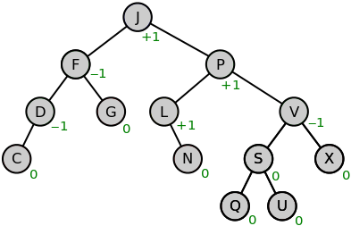

# 알고리즘


1. 정렬 알고리즘   

      * 선택 정렬 (Selection Sort) : 처음 원소부터, 마지막 바로 전 위치까지 있어야할 원소를 하나씩 맞춰가는(좌에서 우) 정렬, 해당 순서에 원소를 넣을 위치는 이미 정해져 있고, 어떤 원소를 넣을지 선택하는 알고리즘이다. 오름차순의 경우 첫번째 위치에 배열에서 가장 작은 값으로 바꾸고, 두번째 위치는 두번째로 작은 값을 위치시키고 하는 과정으로 진행

        * 정렬을 위한 비교 횟수는 많지만, Bubble Sort 에 비해 실제로 교환하는 횟수가 적기 때문에 많은 교환이 일어나야 하는 자료상태에서는 비교적 효율적이다.
        * Bubble Sort와 마찬가지로 배열 안에서 교환하는 방식으로 다른 메모리 공간을 필요로 하지 않는 제자리 정렬(in-place sorting) 이다.
      > 시간 복잡도(비교횟수) : (n-1) + (n-2) + ... +2 + 1 => n(n-1)/2 => O(n^2)
        >
        > 공간 복잡도 : 주어진 배열 안에서 swap 을 통해 정렬이 이루어지므로 O(1) ~= O(n)
      
      * 삽입 정렬 (Insertion Sort) : 현재 위치에서 그 이전 원소들과 비교해가는 과정 (우에서 좌로), 해당 위치 변수는 따로 저장해놓고, 이전 원소들이 비교 조건에 부합하지 않을 때까지 (현재 값보다 작은 원소가 나올 때 까지 (오름차순의 경우)) 비교된 자료들은 오른쪽 index로 밀고, 조건이 부합되면 바로 이전 비교 index+1 한 곳에 따로 저장한 해당 변수 값을 저장시킨다. 2번째 원소부터 시작하여 그 앞(왼쪽)의 원소들과 비교하여 삽입할 위치를 지정한 후, 원소를 뒤로 옮기고 지정된 자리에 자료를 삽입하여 정렬하는 알고리즘이다. 제자리 정렬(in-place sorting) 이다.
      
        > 시간 복잡도 : 최악의 경우(역으로 정렬된 경우)는 선택정렬 처럼 O(n^2)이나 이미 정렬되어 있는 경우에는 시간 복잡도가 O(n)이다. 
        >
        > 공간 복잡도 : 주어진 배열 안에서 swap 을 통해 정렬이 이루어지므로 O(1) ~= O(n)
      
        ```java
        void insertionSort(int[] arr)
        {
           for(int index = 1 ; index < arr.length ; index++){ // 1.
              int temp = arr[index];
              int prev = index - 1;
              while( (prev >= 0) && (arr[prev] > temp) ) {    // 2.
                 arr[prev+1] = arr[prev];
                 prev--;
              }
              arr[prev + 1] = temp;                           // 3.
           }
           System.out.println(Arrays.toString(arr));
        }
        ```
      
        
      
      * 버블 정렬 (Bubble Sort) : 매번 연속된 두개의 인덱스를 비교, 조건에 맞게 두 값을 정렬해가는 것
      
      * 병합 정렬 (Merge Sort) : 분할 정복(Divide and Conquer)방식으로 설계된 알고리즘. 배열을 계속 반으로 쪼개가서 아주 작은 배열들로 분할하고, 작은 것 부터 문제를 해결하여 다른 분할된 배열들과 병합하면서 정렬을 수행한다. 여기서 합병 과정에서 두 배열을 정렬하기 때문에 이 정렬 알고리즘은 O(N)의 시간복잡도를 가진다. 또한 분할 과정은 logN 만큼 일어난다. (트리의 높이와 같은 개념) 따라서, 각 분할별로 합병을 진행하므로 병합 정렬의 시간 복잡도는 O(NlogN)이다.
      
        * merge sort는 순차적인 비교로 정렬을 진행하므로, LinkedList의 정렬이 필요할 때 사용하면 효율적이다. 퀵정렬은 순차 접근이 아닌 임의 접근이기 때문에 LinkedList에서는 효율이 좋지 않다. 
      
        
      
        
      
      * 퀵 정렬 (Quick Sort) : 분할 정복 (Divide and Conquer)방식을 이용한 알고리즘. pivot point 라는 기준점을 설정하여 왼쪽은 이 값보다 작은 값, 큰 값은 오른쪽으로 옮기면서 정렬을 진행, 보통 pivot을 맨 앞이나 맨 뒤, 혹은 전체 배열 값 중 중간값이나 랜덤값으로 설정한다. 따라서, 분할과 동시에 정렬을 진행하는 알고리즘이다. 
      
        * 각 정렬은 배열의 크기 N만큼 비교하고, 이를 총 분할 깊이인 logN 만큼 실행한다. 즉, O(NlogN)의 시간 복잡도를 가진다. 이미 배열이 정렬이 되어 있는 경우(pivot이 항상 그 배열의 최솟값 혹은 최대값인 경우)는 최악의 시간 복잡도를 나타낸다.`(unbalanced-partition)` 이 경우에는, 분할이 N만큼 진행되게 된다.(한 쪽에 쏠리니까?) 따라서 시간 복잡도는 O(N^2)가 된다. -> 이를 방지하기 위해서 pivot point를 전체 배열 값 중 중간 값이나 랜덤 값으로 설정하는 방법을 쓴다.
        
        * 퀵 정렬은 최악의 경우에는 O(N^2)로 얼핏 비효율적이여 보일 수 있지만, 그 경우는 드문 경우이며 일반적으로 합병 정렬보다 20%이상 빠르다고 한다. 이런 이유로 평균적으로 가장 빠른 알고리즘이며 JAVA에서 Arrays.sort() 에서도 Dual Pivot Quick Sort로 구현되어 있을 정도로 효율적인 알고리즘이다.
        
        [QuickSort Code 구현](./code/QuickSort.java)
        
        > 시간 복잡도 : 최선의 경우는 O(nlog2n) , 최악의 경우는 O(n^2)
        
      * 카운팅 정렬 (Counting Sort) : `non-Comparison Sorting Algorithms`으로 몇 개인지 개수를 세어 정렬하는 방식, 배열의 최대값 k를 구하고, k+1길이의 임시 배열을 만들고, 그 임시배열에 index의 값 i를 원래의 배열에서 몇개를 가지고 있는지를 저장한다. -> 이것만 하고 바로 찍어내면 정렬이 되지 않나? but, 배열의 숫자의 편차가 큰 경우 (0,3,200) 4~199 까지 무의미하게 지켜봐야 하는 비효율적 측면이 존재
      
        따라서, 빈도 수 저장한 걸 list[a]+=list[a-1] 라는 매커니즘을 이용해 축적된 수로 저장합니다. 이 누적 리스트를 통해 원래의 배열에서 해당 값이 나올 때, 그 해당 값의 index로 찾아가 누적 값을 얻어서 새로운 정렬 배열에서 어떤 위치에 들어가야 하는지를 판단할 수가 있습니다.  
      
        이 알고리즘의 시간복잡도는 O(n)으로 좋지만, 대부분의 상황에서 엄청난 메모리 낭비를 초래한다. (3,5,6,100)의 경우, 7~99 까지의 쓸모없는 메모리 할당이 초래되기도 하기 때문이다. 이는 점수와 같이 0-100점 처럼 최대값이 작으며 좁은 범위에 존재하는 데이터들을 정렬할 때 유용하게 사용할 수 있다. 특히, index를 이용하므로 정수 값을 이용한다는 점이 존재한다.
      
        대표적으로, 26개의 알파벳으로 이루어진 문자열에서 suffix array를 얻는 경우 사용한다. 
      
      * 기수 정렬 (Radix Sort) : 값의 각 기수(radix)를 같은 위치에 있는 값끼리 묶었다가 순서대로 정렬하는 방식, LSD(Least Significat Digit)과 MSD(Most Significant Digit) 방식이 있는데, 일반적으로 LSD를 주로 이야기 하고 값이 숫자일 때를 예로 들면 일의 자리 부터 같은 거끼리 묶고 백의 자리와 같은 최대 자리 값까지 진행한다.
      
        * 왜 주로 LSD를 이야기 할까?
          * LSD의 경우 1600000 과 1을 비교할 때, Digit의 갯수만큼 따져야하는 단점이 있음. 그에 반해 MSD는 마지막 자리수까지 확인해 볼 필요가 없음.
          * LSD는 중간에 정렬 결과를 알 수 없음. (예) 10004와 70002의 비교) 반면, MSD는 중간에 중요한 숫자를 알 수 있음. 따라서 시간을 줄일 수 있음. 그러나, 정렬이 되었는지 확인하는 과정이 필요하고, 이 때문에 메모리를 더 사용
          * LSD는 알고리즘이 일관됨 (Branch Free algorithm) 그러나 MSD는 일관되지 못함. --> 따라서 Radix sort는 주로 LSD를 언급함.
          * LSD는 자릿수가 정해진 경우 좀 더 빠를 수 있음.
        
        이 방식은 O(n)이라는 시간 복잡도를 가지지만, 범위가 데이터 길이에 의존하게 되어 데이터들이 길이 동일하지 않으면 이 효율이 나타나지 않는다는 단점이 있다. 
        
      * 힙 정렬 (Heap Sort) : binary heap 자료구조를 활용한 sorting 알고리즘, 시간 복잡도는 O(NlogN) 이다
      
        * 과정 : Max-heap 을 구성 후 루트의 값이 최대값이므로 이를 첫번째 값으로 저장 후 맨 마지막 원소를 루트에 올린 후 다시 Max-heap 구성, 이런 식으로 내림차순 정렬
        * 퀵정렬과 합병정렬의 성능이 좋기 때문에 힙 정렬의 사용빈도가 높지는 않지만, 힙 자료구조가 많이 활용되고 있다.
        * heap sort 는 최소값이나 최대값을 구할 때 유용하다

      **Q1) 회사에서, 매우 많은 데이터를 정렬하여야 하는데, 해당 데이터의 개수가 백만 개일때, 어떤 방식으로 정렬할 것인가?**

      데이터의 패턴이나 성질들을 조합해서 정렬법을 선택하겠습니다. 데이터들이 정수로 이뤄져있고, 편차가 적으며 좁은 범위에서 정의된 경우에는 counting sort를 사용하고, 데이터들의 기수 값의 패턴을 어느정도 목록지을 수 있고 길이가 모두 같은 경우는 radix sort를 사용하여 효율을 높이겠습니다. 앞에서와 같이 데이터의 크기나 성질이 가볍게 정의되지 않는다면 가장 무난한 방식은 퀵 정렬 알고리즘을 사용하겠습니다.

      **Q2) Quick sort 가 다른(힙 정렬(heap sort)이나 병합정렬(merge sort)과 비교했을 때) 정렬 알고리즘에 비해서 유리한 이유?**

      Quick sort vs Merge sort vs Heap sort : 3지의 시간 복잡도는 O(NlogN) 으로 동일

      Merge sort : 메모리를 더 많이 차지하는 정렬 구조다. 하지만, 매우 많은 다량의 빅데이터를 정렬해야 하는 경우, 많은 데이터를 작게 쪼개서 quick sort를 진행하고 합친다고 할 때 합칠 때 그냥 합치면 작은 문제로 나누어 한 이유가 없기 때문에 , merge sort를 사용하여 병합한다.

      Heap sort : 계속해서 최대값(최소값)을 추출하고, 새로운 값을 추가하고 할 때, 최대값을 뽑을 때마다 모든 값을 대상으로 정렬할 필요가 없으므로 효율적이다. (새로 들어온 값만 heapifiy를 하면 되니까), 따라서 최대값을 뽑을 때마다 O(NlogN)의 시간 복잡도를 나타내는 quick sort와 달리 heap sort는 O(logN)의 시간 복잡도를 나타낸다.

      Quick sort : quick sort 가 가장 빠르고, 메모리 차지도 가장 작은 편이라 일반적으로 효율적이다. 최악의 경우에는 O(N^2)의 시간복잡도를 가질 수 있지만, pivot point를 잘 설정하면 어느 정도 해결이 가능하고, 평균적으로 잘 일어나지 않는다. 따라서 많이 사용된다. 하지만, N이 매우 작은 경우 partition 함수를 재귀적으로 호출하는 overhead가 더 클 수 있기 때문에 function call이 없는 insertion 정렬 같은 다른 알고리즘을 생각해볼 수 있다.

      일반적인 프로그래밍 언어서 대부분 정렬 라이브러리는 내부적으로 퀵 정렬을 기반 구현 -> 다른 정렬 알고리즘에 비해서 퀵 정렬이 유리할 수 있는 이유, 유리할 수 있다는 점

      **Q3) 퀵 정렬의 시간 복잡도가 NlogN이 나올 수 있는지, 그럴 수 없다면 왜인지? -> 실제로 최악의 경우는 N^2까지 나올 수 있음 -> 그래서 NlogN으로 보장하는 방법이 어떤 것이 있는지**

      보통의 경우에는 NlogN이 나오지만, pivot point가 매번 그 배열의 최댓값 혹은 최소값을 선택하게 되는 경우 배열의 분할이 한쪽으로만 일어나게 되어 분할의 횟수가 N개 까지 나타나게 됩니다. 따라서 최악의 경우에는 N^2의 시간복잡도를 가지게 됩니다. 이를 해결하는 방법으로 pivot point를 그 배열의 중간값으로 잡거나, random하게 설정하는 방법이 있습니다.

      **Q4) 기본적인 정렬 알고리즘 시간복잡도, 다른 정렬 알고리즘에 비해 각각의 정렬 알고리즘이 가지는 특징 ! **

      **Q5) 병합졍렬의 Best Case가 NlogN나오는 것 수학적으로 설명**

      배열을 계속 1/2씩 쪼개니까 그 분할의 깊이는 log(2)N이다. 즉 병합의 과정을 logN번 하게 되는데, 병합시에 정렬이 N만큼 일어나므로 총 NlogN이 나온다.


2. minimal spanning tree 에 대해서 설명하시오

   * spanning tree 는 그래프의 간선의 수가 가장 적은 연결 그래프 이다. 대신 이 엣지들에 사이클이 존재하면 안된다. (그래프의 최소 연결 부분 그래프)

   * n개의 엣지가 있는 그래프의 최소 간선의 수는 (n-1)개 이고, (n-1)개의 간선으로 연결되어 있으면 필연적으로 트리 형태가 되고 이것이 바로 spanning tree이다.

   * 모든 정점들이 연결 되어 있고, 사이클이 포함되어서는 안된다.
   * 그 중에서 minimal spanning tree 라는 것은 spanning tree에서 간선들의 가중치의 합이 최소인 트리를 말한다. 이 과정은 통신망, 도로망 등의 구축, 전송 시간 등등을 최소로 구출하려 할 때 사용되어질 수 있다.
   
3. 크루스칼(Kruskal) 알고리즘에 대해 설명하시오.

   * 탐욕적인 방법을 이용한 것으로, 각 단계에서 사이클을 이루게 되지 않는 최소 비용의 간선 부터 차근차근 선택하는 방식이다.
   * 그래프의 간선들을 가중치의 오름차순으로 정렬하고, 정렬된 리스트에서 가장 낮은 가중치를 먼저 선택하고, 그 가중치의 간선이 사이클을 이루지 않는지(간선 양끝의 노드가 모두 이미 선택되지 않았는지)확인 후에 적합하면 그 간선을 선택해나간다. 이렇게, n-1개의 간선이 선택될 때 까지 반복한다.
   
4. Prime MST 알고리즘에 대해 설명하시오.

   * 시작 정점으로부터 신장트리 집합을 단계적으로 확장해나가는 방법이다.
   * 처음에 한 정점으로 시작을 하고, 이 정점이 연결된 간선들 중에서 가장 최소의 가중치로 연결된 노드를 다음 노드로 선택하는데, 그 다음 노드가 이미 이전에 선택된 이력이 있으면 그 다음으로 큰 가중치를 가지는 애를 다음 노드로 설정하는 식으로 사이클을 이루지 않는 최소한의 가중치를 가지는 노드들을 추가해나간다. 이렇게, n-1개의 간선이 선택될 때 까지 반복한다.
   
5. 크루스칼의 알고리즘을 사용하려고 하는데, 최대값 가중치를 가지는 edge 부터 제거해서 MST 가 남을때까지 하고 싶다면 가능할까요? 왜 그렇게 생각해요?

   * 기존의 알고리즘으로는 불가능할 것 같습니다. 왜냐하면 싸이클을 피할 수 없게 되기 때문입니다. 최대값 부터 지워나가면 제일 최소 값들의 간선만 선택이 되는데, 제일 최소 값들의 간선만 선택을 하면 사이클 유무에 대한 검사가 진행된 상태가 아니기 때문입니다.
   
6. BST란?

   * Binary Search Tree 로 각 노드의 왼쪽 서브 트리에는 해당 노드의 값보다 작은 값을 지닌 노드를, 오른쪽은 더 큰 노드를 배치하는 트리 이다. 이 트리를 이용하면 탐색에 걸리는 계산 복잡성은 트리의 높이와 관계가 있다. O(높이) 즉 -> O(log2(N+1))
   
7. BST 에서 worst case 는 무엇인가? 또 그것을 해결하려면 어떻게 해야하나

   - 가장 최악은 트리가 한 방향으로만 배치되어 있는 경우 입니다.
   - 이를 해결 하기 위해 균형 트리를 사용합니다. (AVL tree, B-tree)
   
8. 균형 트리를 recursive definition 으로 표현해보시오

9. B-Tree 를 쓰는 이유는? 무엇이 효율적인가

10. AVL tree 로 어떻게 변형하는지 과정을 자세히 말해보시오

   

   * AVL 트리는 각 노드에서 왼쪽 서브 트리와 오른쪽 서브 트리의 높이 차이가 1를 넘지 않도록 유지하는 트리 이다. 즉, 균형 인수(왼쪽 서브 트리 높이에서 오른쪽 서브 트리 높이를 뺀 값)는 -1,0,1, 중 하나여야만 한다.
   * 자료 삭제 혹은 삽입시, AVL 균형이 무너지지 않도록 트리 구조의 재배치를 통해 BF(균형 인수)값을 -1,0,1 의 값으로 조정시켜 준다.
   * 조정 과정은 4가지 단계로 이루어 진다.
     * LL 왼쪽으로만 높이가 2이상 높은 경우 -> Right Rotation 수행
     * RR -> LL과 반대
     * LR 왼쪽 서브트리가 높이가 1더 높은데, 왼쪽 서브트리의 오른쪽 때문에 차이가 있는 경우 -> Left Rotation 수행 후(LL 모양이 되도록), Right Rotation실행
     * RL -> LR 과 반대
   * 균형 유지로 일정 수준의 검색 성능을 보장하지만 자료의 개수 증가로 트리의 높이가 계속해서 높아진다는 문제점이 존재한다. 그리고, 자료의 추가나 삭제가 빈번하게 발생하면 오버헤드가 커진다.
     

11. 그래프가 있을때 어떤 정점에서 어떤 정점까지의 최단거리를 구하려고 할 때 어떤 알고리즘을 쓸 것인가?

    * 다익스트라 알고리즘 

      * 한 점에서 모든 점까지 최단 거리를 구하는데, 가중치가 양수일 때만 사용한다. 
      * 다이나믹 프로그래밍의 일종이다. 왜냐하면, 현재 정점에 이전 정점까지의 최단 거리에서 현재 정점으로 가는 최소의 가중치를 더해나가기 때문이다.
      * 과정은, 출발 노드를 설정하고 그 노드가 닿을 수 있는 다음 노드들에 해당 가중치를 저장한다. 그 연결된 간선중 가장 작은 간선으로 연결된 노드를 다음 노드로 설정한다. 그 다음 노드에서 또 연결된 간선들을 이용해서, 해당 노드에 오기 까지의 가중치와 그 간선이 연결된 그 다음 다음 노드에 가기 까지의 가중치를 더하고, 그 더한 값이, 현재 그 다음 다음 노드에 저장된 거리 값보다 작으면 그 더한 값으로 업데이트 해줍니다. 이런 식으로 과정을 반복하여 노드들을 모두 검색합니다.

    * 플로이드 와샬 알고리즘

      * 모든 정점에서 모든 정점으로의 최단 경로를 구하고 싶을 때 사용하는 알고리즘 -> 거쳐가는 정점을 기준으로 알고리즘을 수행, 이 알고리즘 또한 다이나믹 프로그래밍을 기초로 둔다.
      * i 에서 j 로 가는 최소 비용 > i에서 k로 갔다가 j로 가는 최소 비용을 비교

      ```c++
      for(int k=0; k<number; k++){
        for(int i=0; i<number; i++){
          for(int j=0; j<number; j++){
            if(d[i][k]+d[k][j]<d[i][j]){
              d[i][j]=d[i][k]+d[k][j]
            }
          }
        }
      }
      ```

      

12. 플로이드 알고리즘이랑 다익스트라랑 시간복잡도 비교해봐. 뭐가 더 좋을까? 그럼 어느 상황에서 무슨 알고리즘이 유리할지 수식이나 정확힌 기준을 적어봐. 
    한 정점에서 다른 정점들로 가는 최적의 경로를 알고싶을때는 다익스트라 알고리즘을
    모든 정점에서 모든 정점들로 가는 최적의 경로를 알고싶을때는 플로이드 알고리즘을 사용할 것 입니다.

13. sorting 배운것들 중에 뭐가 unstable sort인지 stable sort인지 말해봐. 
    

14. 이분 탐색 (Binary Search)

    > 탐색 범위를 두 부분으로 분할하면서 찾는 방식
    >
    > 처음부터 끝까지 순차적으로 탐색하는 것보다 훨씬 빠름
    >
    > 전체 탐색 : O(N)
    >
    > 이분 탐색 : O(logN)

    - 데이터 정렬
    - left와 right로 mid 값 설정 (보통은 mid=(left+rigjt)/2)
    - mid와 내가 구하고자 하는 값과 비교
    - 구할 값이 mid보다 높으면 : left = mid+1 , 구할 값이 mid보다 낮으면 : right = mid - 1
    - left > right가 될 때까지 계속 반복
      

15. 해시 테이블 (Hash Table)

    > 관련 설명 [자료구조.pdf](./자료구조.pdf) 참고 

    chaining 방식을 이용한 hash table 알고리즘 구현 예

    ```sh
    1. apple이 들어옴. key 값을 얻으니 5가 나옴. length[5]는 0이므로 처음 들어온 데이터임. length[5]++하고 "OK"출력
    
    2. banana가 들어옴. key 값을 얻으니 3이 나옴. length[3]은 0이므로 처음 들어온 데이터임. length[3]++하고 "OK"출력
    
    << 중요 >>
    3. abc가 들어옴. key 값을 얻으니 5가 나옴. length[5]는 0이 아님. 해당 key 값에 누가 들어온적이 있음. 
    length[5]만큼 반복문을 돌면서 s_data[key]의 배열과 abc가 일치하는 값이 있는지 확인함. 현재 length[5]는 1이고, s_data[key][0] = "apple"이므로 일치하는 값이 없기 때문에 length[5]를 1 증가시키고 s_data[key][length[5]]에 abc를 넣고 "OK"출력
    
    << 중요 >>
    4. abc가 들어옴. key 값을 얻으니 5가 나옴. length[5] = 2임.
    s_data[key]를 2만큼 반복문을 돌면서 abc가 있는지 찾음. 1번째 인덱스 값에는 apple이 저장되어 있고 2번째 인덱스 값에서 abc가 일치함을 찾았음!!
    따라서 해당 data[key][index] 값을 1 증가시키고 이 값을 return 해주면서 메소드를 끝냄
    → 메인함수에서 input으로 들어온 abc 값과 리턴값으로 나온 1을 붙여서 출력해주면 됨 (abc1)
    ```

16. BFS & DFS

    
    


# 참고

https://m.blog.naver.com/PostView.nhn?blogId=qbxlvnf11&logNo=221371740002&proxyReferer=https:%2F%2Fwww.google.com%2F

[Tistroy: 기본 정렬 알고리즘](https://hsp1116.tistory.com/33)

[Tistroy: Counting Sort](https://bowbowbow.tistory.com/8)

[Tistroy: Sorting Algorithm 을 비판적으로 바라보자](http://asfirstalways.tistory.com/338)