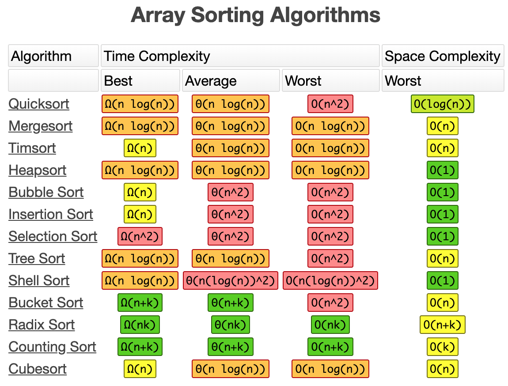

# 자료구조

: '비교'를 중심으로 공부를 하는 것이 가장 좋음

- Array / LinkedList
- Stack / Queue
- HashSet / HashMap / HashTable / Dictionary
- Tree / Binary tree
- Heap
- Graph


1. 자료구조 라이브러리를 많이 사용해 보았는가?

   다양한 라이브러리 구조를 사용해 본 경험이 있다. 여러 프로젝트를 진행하면서 Java나 c등 내장된 자료구조 STL을 사용하였다. 웹 개발 할때, 데이터 베이스에 담긴 내용들을 한꺼번에 select할때, ArrayList에 담는 등 때에 따라 리스트 형태를 사용하기도 하고 map형태를 사용하기도 하면서, 다양한 자료구조의 쓰임을 이해해왔다. 또한, 알고리즘 공부를 하고 문제를 풀면서 다양한 자료구조를 이용했다.

2. 배열 (Array) vs 연결 리스트 (LinkedList)

   **Q1) 두 자료구조를 설명해보세요.**

   배열은 데이터를 자체로 순차적으로 메모리에 올린 것, 다수의 데이터를 순차적으로 접근할 수 있고, 랜덤 접근(random access)가 가능하기 때문에 자료를 검색하는 것에 매우 효과적이다. 하지만, 데이터가 연속되어 있을 때, 데이터를 삽입하거나 삭제를 하면, 다른 데이터들의 저장 주소를 모두 옮겨야하는 비효율이 존재한다. 반면, 연결리스트는 각각의 데이터를 포인터로 순서를 유지시키는 자료구조 이다. 이는 포인터만 끊어 주거나 변경해주면 되기 때문에 삽입과 삭제가 매우 효율적으로 동작하는 구조이다. 대신에, 어떤 index에 접근하기 위해 처음 index부터 순차적으로 접근해야 하기 때문에 검색이 조금 더 오래걸리는 단점이 있다.

   하지만, 추가적으로 연결 리스트 자료구조는 search 에 O(n)의 시간 복잡도(time complexity)를 갖는데, 삽입과 삭제 과정에서도 어떤 특정 원소를 찾아야 하기 때문에 O(n)의 시간이 추가적으로 발생하게 된다는 사실이 있다. 따라서, 검색,삽입,삭제에 O(n)의 시간 복잡도를 가진다는 것이다. 그렇지만, LinkedList는 tree구조의 근간이 되며, Tree에서 사용되었을 때 유용성이 드러난다.

3. 정렬 알고리즘 (특히, Quick sort 중요)

   

   * 선택 정렬 (Selection Sort) : 처음 원소부터, 마지막 바로 전 위치까지 있어야할 원소를 하나씩 맞춰가는(좌에서 우) 정렬

   * 삽입 정렬 (Insertion Sort) : 현재 위치에서 그 이전 원소들과 비교해가는 과정 (우에서 좌로), 해당 위치 변수는 따로 저장해놓고, 이전 원소들이 비교 조건에 부합하지 않을 때까지 (현재 값보다 작은 원소가 나올 때 까지 (오름차순의 경우)) 비교된 자료들은 오른쪽 index로 밀고, 조건이 부합되면 바로 이전 비교 index+1 한 곳에 따로 저장한 해당 변수 값을 저장시킨다. 이미 정렬되어 있는 경우에는 시간 복잡도가 O(n)이다.

   * 버블 정렬 (Bubble Sort) : 매번 연속된 두개의 인덱스를 비교, 조건에 맞게 두 값을 정렬해가는 것

   * 병합 정렬 (Merge Sort) : 분할 정복(Divide and Conquer)방식으로 설계된 알고리즘. 배열을 계속 반으로 쪼개가서 아주 작은 배열들로 분할하고, 작은 것 부터 문제를 해결하여 다른 분할된 배열들과 병합하면서 정렬을 수행한다. 여기서 합병 과정에서 두 배열을 정렬하기 때문에 이 정렬 알고리즘은 O(N)의 시간복잡도를 가진다. 또한 분할 과정은 logN 만큼 일어난다. (트리의 높이와 같은 개념) 따라서, 각 분할별로 합병을 진행하므로 병합 정렬의 시간 복잡도는 O(NlogN)이다.

   * 퀵 정렬 (Quick Sort) : 분할 정복 (Divide and Conquer)방식을 이용한 알고리즘. pivot point 라는 기준점을 설정하여 왼쪽은 이 값보다 작은 값, 큰 값은 오른쪽으로 옮기면서 정렬을 진행, 보통 pivot을 맨 앞이나 맨 뒤, 혹은 전체 배열 값 중 중간값이나 랜덤값으로 설정한다. 따라서, 분할과 동시에 정렬을 진행하는 알고리즘이다. 각 정렬은 배열의 크기 N만큼 비교하고, 이를 총 분할 깊이인 logN 만큼 실행한다. 즉, O(NlogN)의 시간 복잡도를 가진다. 이미 배열이 정렬이 되어 있는 경우(pivot이 항상 그 배열의 최솟값 혹은 최대값인 경우)는 최악의 시간 복잡도를 나타낸다.`(unbalanced-partition)` 이 경우에는, 분할이 N만큼 진행되게 된다.(한 쪽에 쏠리니까?) 따라서 시간 복잡도는 O(N^2)가 된다. -> 이를 방지하기 위해서 pivot point를 전체 배열 값 중 중간 값이나 랜덤 값으로 설정하는 방법을 쓴다.

     퀵 정렬은 최악의 경우에는 O(N^2)로 얼핏 비효율적이여 보일 수 있지만, 그 경우는 드문 경우이며 일반적으로 합병 정렬보다 20%이상 빠르다고 한다.

     ```java
     import java.util.*;
     
     public class Solv {
     
     	// partition
     	public static int partition(int[] tmp, int left, int right) {
     		int point = (left + right) / 2;
     		int pivot = tmp[point];
     		while (left < right) {
     			// System.out.println("e");
     			while (left <= right && tmp[left] <= pivot)
     				++left;
     			while (left <= right && tmp[right] > pivot)
     				--right;
     			// 1 1 2 5 5 3 3
     			// left : 2 , right : 3
     			// left : 4 , right : 3
     			if (left <= right) {
     				int temp = tmp[left];
     				tmp[left] = tmp[right];
     				tmp[right] = temp;
     
     				// right는 다 통과해서 point 까지 왔는데 left는 아직 남은 경우 기준점을 변경
     				if (right == point) {
     					// right는 point 까지 접근 가능 (같은거 포함안하니까)
     					// point index랑 left랑 바꾸니까 left가 새로운 pivot됨
     					return left;
     				}
     			}
     		}
     		// 마지막에 left는 다 통과되고 right에는 바꿀 게 남은 경우 기준점을 변경
     		if (right != point) {
     			int temp = tmp[point];
     			tmp[point] = tmp[right];
     			tmp[right] = temp;
     		}
     		return right;
     
     	}
     
     	public static void quickSort(int[] ori, int left, int right) {
     		if (left < right) {
     			int newPivot = partition(ori, left, right);
     			quickSort(ori, left, newPivot - 1);
     			//System.out.println("left:" + Arrays.toString(ori));
     			quickSort(ori, newPivot + 1, right);
     			//System.out.println("right:" + Arrays.toString(ori));
     		}
     	}
     
     	public static void main(String[] args) {
     
     		int[] a = { 1, 3, 56, 8, 9, 3, 2, 1, 23, 11, 10 };
     
     		quickSort(a, 0, a.length - 1);
     		System.out.println(Arrays.toString(a));
     
     	}
     }
     ```

     

   * 카운팅 정렬 (Counting Sort) : `non-Comparison Sorting Algorithms`으로 몇 개인지 개수를 세어 정렬하는 방식, 배열의 최대값 k를 구하고, k+1길이의 임시 배열을 만들고, 그 임시배열에 index의 값 i를 원래의 배열에서 몇개를 가지고 있는지를 저장한다. -> 이것만 하고 바로 찍어내면 정렬이 되지 않나? but, 배열의 숫자의 편차가 큰 경우 (0,3,200) 4~199 까지 무의미하게 지켜봐야 하는 비효율적 측면이 존재

     따라서, 빈도 수 저장한 걸 list[a]+=list[a-1] 라는 매커니즘을 이용해 축적된 수로 저장합니다. 이 누적 리스트를 통해 원래의 배열에서 해당 값이 나올 때, 그 해당 값의 index로 찾아가 누적 값을 얻어서 새로운 정렬 배열에서 어떤 위치에 들어가야 하는지를 판단할 수가 있습니다.  

     이 알고리즘의 시간복잡도는 O(n)으로 좋지만, 대부분의 상황에서 엄청난 메모리 낭비를 초래한다. (3,5,6,100)의 경우, 7~99 까지의 쓸모없는 메모리 할당이 초래되기도 하기 때문이다. 이는 점수와 같이 0-100점 처럼 최대값이 작으며 좁은 범위에 존재하는 데이터들을 정렬할 때 유용하게 사용할 수 있다. 특히, index를 이용하므로 정수 값을 이용한다는 점이 존재한다.

     대표적으로, 26개의 알파벳으로 이루어진 문자열에서 suffix array를 얻는 경우 사용한다. 

   * 기수 정렬 (Radix Sort) : 값의 각 기수(radix)를 같은 위치에 있는 값끼리 묶었다가 순서대로 정렬하는 방식, LSD(Least Significat Digit)과 MSD(Most Significant Digit) 방식이 있는데, 일반적으로 LSD를 주로 이야기 하고 값이 숫자일 때를 예로 들면 일의 자리 부터 같은 거끼리 묶고 백의 자리와 같은 최대 자리 값까지 진행한다.

     이 방식은 O(n)이라는 시간 복잡도를 가지지만, 범위가 데이터 길이에 의존하게 되어 데이터들이 길이 동일하지 않으면 이 효율이 나타나지 않는다는 단점이 있다. 
     
   * 힙 정렬 (Heap Sort) : binary heap 자료구조를 활용한 sorting 알고리즘, 시간 복잡도는 O(NlogN) 이다

   **Q1) 회사에서, 매우 많은 데이터를 정렬하여야 하는데, 해당 데이터의 개수가 백만 개일때, 어떤 방식으로 정렬할 것인가?**

   데이터의 패턴이나 성질들을 조합해서 정렬법을 선택하겠습니다. 데이터들이 정수로 이뤄져있고, 편차가 적으며 좁은 범위에서 정의된 경우에는 counting sort를 사용하고, 데이터들의 기수 값의 패턴을 어느정도 목록지을 수 있고 길이가 모두 같은 경우는 radix sort를 사용하여 효율을 높이겠습니다. 앞에서와 같이 데이터의 크기나 성질이 가볍게 정의되지 않는다면 가장 무난한 방식은 퀵 정렬 알고리즘을 사용하겠습니다.

   **Q2) Quick sort 가 다른(힙 정렬(heap sort)이나 병합정렬(merge sort)과 비교했을 때) 정렬 알고리즘에 비해서 유리한 이유?**

   Quick sort vs Merge sort vs Heap sort : 3지의 시간 복잡도는 O(NlogN) 으로 동일

   Merge sort : 메모리를 더 많이 차지하는 정렬 구조다. 하지만, 매우 많은 다량의 빅데이터를 정렬해야 하는 경우, 많은 데이터를 작게 쪼개서 quick sort를 진행하고 합친다고 할 때 합칠 때 그냥 합치면 작은 문제로 나누어 한 이유가 없기 때문에 , merge sort를 사용하여 병합한다.

   Heap sort : 계속해서 최대값(최소값)을 추출하고, 새로운 값을 추가하고 할 때, 최대값을 뽑을 때마다 모든 값을 대상으로 정렬할 필요가 없으므로 효율적이다. (새로 들어온 값만 heapifiy를 하면 되니까), 따라서 최대값을 뽑을 때마다 O(NlogN)의 시간 복잡도를 나타내는 quick sort와 달리 heap sort는 O(logN)의 시간 복잡도를 나타낸다.

   Quick sort : quick sort 가 가장 빠르고, 메모리 차지도 가장 작은 편이라 일반적으로 효율적이다. 최악의 경우에는 O(N^2)의 시간복잡도를 가질 수 있지만, pivot point를 잘 설정하면 어느 정도 해결이 가능하고, 평균적으로 잘 일어나지 않는다. 따라서 많이 사용된다. 하지만, N이 매우 작은 경우 partition 함수를 재귀적으로 호출하는 overhead가 더 클 수 있기 때문에 function call이 없는 insertion 정렬 같은 다른 알고리즘을 생각해볼 수 있다.

   일반적인 프로그래밍 언어서 대부분 정렬 라이브러리는 내부적으로 퀵 정렬을 기반 구현 -> 다른 정렬 알고리즘에 비해서 퀵 정렬이 유리할 수 있는 이유, 유리할 수 있다는 점

   **Q3) 퀵 정렬의 시간 복잡도가 NlogN이 나올 수 있는지, 그럴 수 없다면 왜인지? -> 실제로 최악의 경우는 N^2까지 나올 수 있음 -> 그래서 NlogN으로 보장하는 방법이 어떤 것이 있는지**

   보통의 경우에는 NlogN이 나오지만, pivot point가 매번 그 배열의 최댓값 혹은 최소값을 선택하게 되는 경우 배열의 분할이 한쪽으로만 일어나게 되어 분할의 횟수가 N개 까지 나타나게 됩니다. 따라서 최악의 경우에는 N^2의 시간복잡도를 가지게 됩니다. 이를 해결하는 방법으로 pivot point를 그 배열의 중간값으로 잡거나, random하게 설정하는 방법이 있습니다.

   **Q4) 기본적인 정렬 알고리즘 시간복잡도, 다른 정렬 알고리즘에 비해 각각의 정렬 알고리즘이 가지는 특징 ! **

   **Q5) 병합졍렬의 Best Case가 NlogN나오는 것 수학적으로 설명**

   배열을 계속 1/2씩 쪼개니까 그 분할의 깊이는 log(2)N이다. 즉 병합의 과정을 logN번 하게 되는데, 병합시에 정렬이 N만큼 일어나므로 총 NlogN이 나온다.

4. Stack VS Queue

   스택은 LIFO 구조로 나중에 들어간 것이 먼저 나옵니다. 이는 괄호 합 판단이나, -> 내부 메모리 구조가 기본적으로 스택 형태 -> 재귀 함수, 스택처럼 단계적으로 쌓여서 차례대로 먼저 해결되는 방식

   큐는 FIFO 구조로 우선순위 큐 형태로 많이 사용되고 있고, 다익스트라 알고리즘 처럼 최단경로 알고리즘에도 쓰이고, 운영체제나 다양한 생산 공정 등에도 쓰이고 있음

5. Heap

   완전 이진 트리의 일종으로 우선순위 큐를 위하여 만들어진 구조, 여러 개의 값들 중에서 최댓값(Max heap)이나 최솟값(Min heap)을 빠르게 찾아내도록 만들어진 자료구조이다.

   Max heap의 경우에는 부모 노드의 키 값이 자식 노드의 키 값 보다 큰 이진 트리이다.
   
   [Heap 구현 with Java](./code/Heap.java)
   
   **Q1) Heap 이 무엇인가?**
   
   우선순위 큐를 구현하기 위한 한 방법, 맥스 힙과 민 힙으로 구분된다. 맥스힙은 그 노드의 자식보다 부모가 더 큰 형태, 일종의 트리 형태, 여기서 root값이 가장 최대 값이 되므로, 그 데이터에서 root를 하나씩 뽑아내면 이미 내림차순으로 정렬이된 배열을 뽑아낼 수 있다. -> 우선 순위 큐를 만들 수 있는 방법 중 하나 -> 이 개념을 이용한 것이 heap 정렬이다


   ## 출처

이미지 : https://www.bigocheatsheet.com/

[Github: Interview_Question_for_Beginner](https://github.com/JaeYeopHan/Interview_Question_for_Beginner/)

[Tistroy: 기본 정렬 알고리즘](https://hsp1116.tistory.com/33)

[Tistroy: Counting Sort](https://bowbowbow.tistory.com/8)

[Tistroy: Sorting Algorithm 을 비판적으로 바라보자](http://asfirstalways.tistory.com/338)