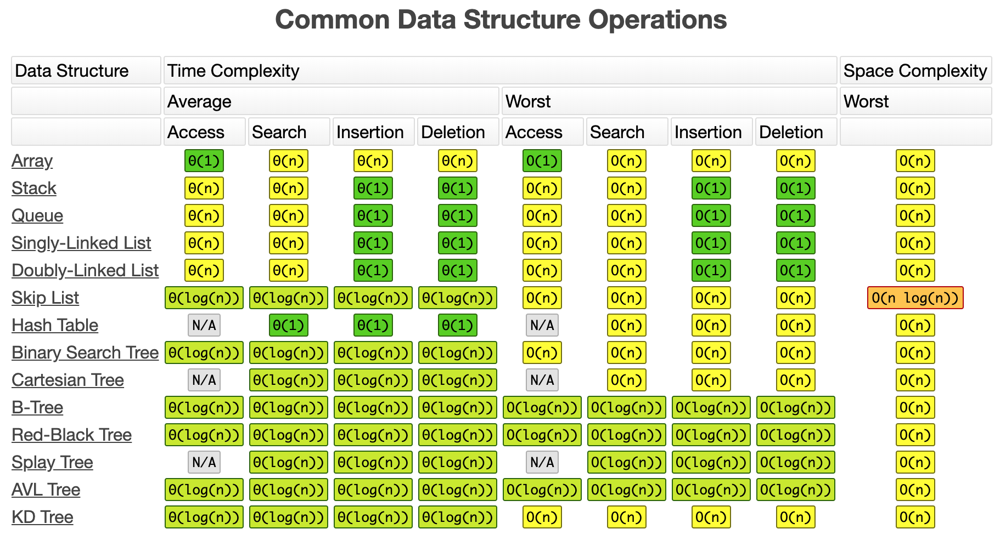
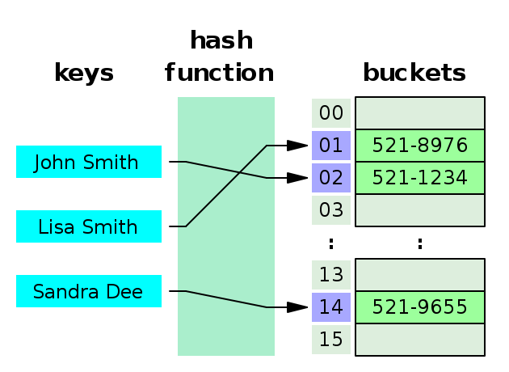
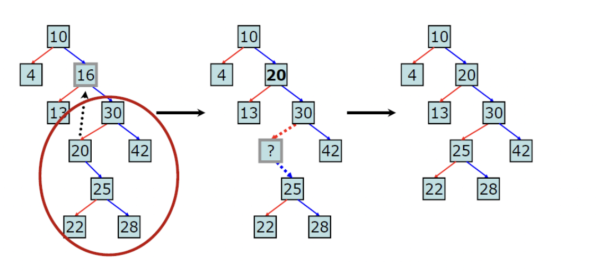
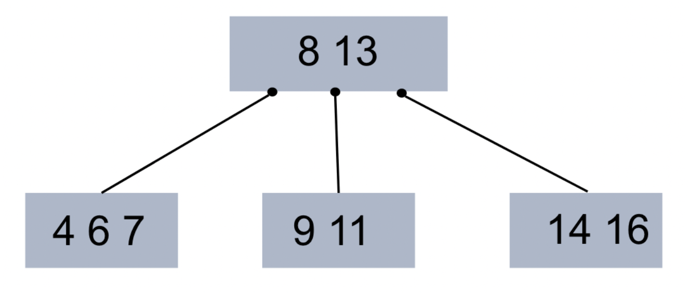
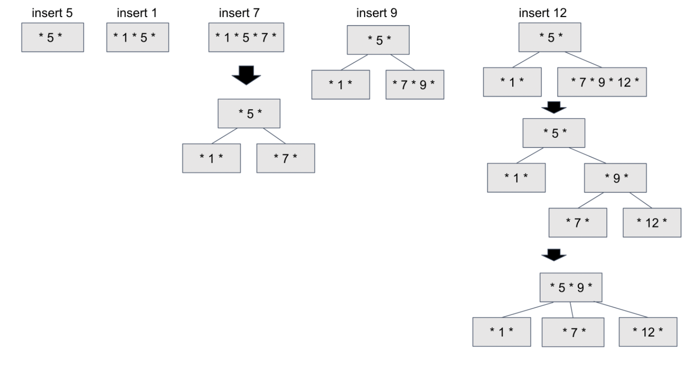

# 자료구조

: '비교'를 중심으로 공부를 하는 것이 가장 좋음

- Array / LinkedList
- Stack / Queue
- HashSet / HashMap / HashTable / Dictionary
- Tree / Binary tree
- Heap
- Graph



1. 자료구조 라이브러리를 많이 사용해 보았는가?

   다양한 라이브러리 구조를 사용해 본 경험이 있다. 여러 프로젝트를 진행하면서 Java나 c등 내장된 자료구조 STL을 사용하였다. 웹 개발 할때, 데이터 베이스에 담긴 내용들을 한꺼번에 select할때, ArrayList에 담는 등 때에 따라 리스트 형태를 사용하기도 하고 map형태를 사용하기도 하면서, 다양한 자료구조의 쓰임을 이해해왔다. 또한, 알고리즘 공부를 하고 문제를 풀면서 다양한 자료구조를 이용했다.
   또한, 파이썬에서 thread를 운용할때, 공유되는 데이터의 효율적 사용을 위해 queue구조를 사용하여 순차적 처리가 가능하도록 하였다.

2. 배열 (Array) vs 배열 리스트 (ArrayList) vs 연결 리스트 (LinkedList)

   - 배열은 메모리 공간에 할당할 사이즈를 미리 정해놓고 사용하며 데이터를 메모리에 순차적으로 올린 것이다. 다수의 데이터를 순차적으로 접근할 수 있고, 랜덤 접근(random access)이 가능하기 때문에 자료를 검색하는 것에 매우 효과적이다. 하지만, 데이터가 연속되어 있을 때, 데이터를 삽입하거나 삭제를 하면, 다른 데이터들의 저장 주소를 모두 옮겨야하는 비효율이 존재한다. 
     
   - 이를 해결하기 위해 나온 것이 List이다. List는 array 처럼 크기를 처음에 정해주지 않아도 된다. 따라서 중간에 데이터를 추가 하여도 array에서의 비효율을 해결할 수 있다. ArrayList 의 경우에는 index를 가지고 있으므로 검색도 빠르다. 하지만 ArrayList 는 LinkedList 에 비해 추가,삭제의 시간이 오래걸린다.
   
   - 반면, 연결리스트는 각각의 데이터를 포인터로 순서를 유지시키는 자료구조 이다. 이는 포인터만 끊어 주거나 변경해주면 되기 때문에 삽입과 삭제가 매우 효율적으로 동작하는 구조이다. 대신에, 어떤 index에 접근하기 위해 처음 index부터 순차적으로 접근해야 하기 때문에 검색이 조금 더 오래걸리는 단점이 있다.
   
   - 하지만, 추가적으로 연결 리스트 자료구조는 search 에 O(n)의 시간 복잡도(time complexity)를 갖는데, 삽입과 삭제 과정에서도 어떤 특정 원소를 찾아야 하기 때문에 O(n)의 시간이 추가적으로 발생하게 된다는 사실이 있다. 따라서, 검색,삽입,삭제에 O(n)의 시간 복잡도를 가진다는 것이다. 그렇지만, LinkedList는 tree구조의 근간이 되며, Tree에서 사용되었을 때 유용성이 드러난다.
     


4. Stack vs Queue

   스택은 LIFO 구조로 나중에 들어간 것이 먼저 나옵니다. 괄호 합 판단, 내부 메모리 구조가 기본적으로 스택 형태, 재귀 함수 (스택처럼 단계적으로 쌓여서 차례대로 먼저 해결되는 방식) 등에 쓰임

   큐는 FIFO 구조로 처음 들어간 것이 먼저 나오는 구조 입니다. 우선순위 큐 형태로 많이 사용되고 있고, 다익스트라 알고리즘 처럼 최단경로 알고리즘에도 쓰이고, 운영체제나 다양한 생산 공정 등에도 쓰이고 있음
   

5. Heap

   완전 이진 트리의 일종으로 우선순위 큐를 위하여 만들어진 구조, 여러 개의 값들 중에서 최댓값(Max heap)이나 최솟값(Min heap)을 빠르게 찾아내도록 만들어진 자료구조이다.

   > Max heap의 경우에는 부모 노드의 키 값이 자식 노드의 키 값 보다 큰 이진 트리이다.
   
   [Heap 구현 with Java](./code/Heap.java)
   
   **Q1) Heap 이 무엇인가?**
   
   완전 이진 트리의 일종으로 우선순위 큐를 구현하기 위한 한 방법, 맥스 힙과 민 힙으로 구분된다. 맥스힙은 그 노드의 자식보다 부모가 더 큰 형태, 일종의 트리 형태, 여기서 root값이 가장 최대 값이 되므로, 그 데이터에서 root를 하나씩 뽑아내면 이미 내림차순으로 정렬이된 배열을 뽑아낼 수 있다. -> 우선 순위 큐를 만들 수 있는 방법 중 하나 -> 이 개념을 이용한 것이 heap 정렬이다.
   
   최대값과 최소값을 빠르게 찾아내도록 만들어진 자료구조이다.
   
   ```sh
   왼쪽 자식 index = (부모 index) * 2
   
   오른쪽 자식 index = (부모 index) * 2 + 1
   
   부모 index = (자식 index) / 2
   ```
   
   
   
6. 우선순위큐 (priority queue)

   - 우선순위를 더해서 우선순위가 높은 것이 먼저 처리되는 큐(queue), 주로 heap구조에 기반하여 구현한다. 이진 트리의 형식으로 우선순위가 가장 높은 데이터가 root에 자리하게 된다. 

   - 새로운 데이터가 들어오면 일단, 이진트리가 유지되는 제일 마지막 위치에 삽입하고, 그 데이터의 부모 노드들과 우선순위를 비교하여 더 높으면 부모 노드와 자리를 바꾸고 그렇지 않으면 자리를 그대로 유지한다.

   - 삭제 기능은 우선순위가 가장 높은 데이터 부터 삭제하므로 루트 자리에 있는 데이터가 삭제가 되고, 그 후에 조건 유지를 위해 가장 마지막 데이터를 루트로 올린 후 자식 노드와 비교하면서 제자리를 찾게된다.
     

7. Hash Table

   > 연관 배열(associative array) 구조 이용
   >
   > 연관 배열 이란? 키와 값이 1:1로 연관되는 자료구조

   - Hash Table 은 key,value,hash function,hash,bucket(저장소) 으로 이루어진 자료구조로 key 값을 hash function에 넣어서 일정한 길이의 hash값으로 변경하고 이에 대응되는 메모리 공간(bucket)에 value를 저장하는 구조이다.

   

   - 하지만 무한한 길이(제각각의 길이)의 key값을 정적인 유한한 길이의 hash값으로 만드는 과정에서 당연히 충돌이 나타날 수 밖에 없다. 이 문제를 hash collision문제라고 한다. 
     삽입,삭제,검색 시간복잡도 big O : O(1)   but hash collision -> O(n)
     hash collision을 해결하기 위한 방법 대표적인 2가지 : 
     - (1) chaining
       * 충돌되는 데이터들을 연결 리스트로 묶기
     - (2) open addressing
       * 비어있는 해시에 충돌값 저장하기
   - 충돌 문제가 있지만 해시 테이블을 쓰는 이유는?
     - 적은 자원으로 많은 데이터를 효율적으로 관리하기 위해
       - 하드디스크나 클라우드에 존재하는 무한한 데이터들을 유한한 개수의 해시값으로 매핑하면 작은 메모리로도 프로세스 관리가 가능해짐
         
   
8. Binary Search Tree 란? (이진 탐색 트리)

   > 1. 각 노드의 자식이 2개 이하
   > 2. 각 노드의 왼쪽 자식은 부모보다 작고, 오른쪽 자식은 부모보다 큼
   > 3. 중복된 노드가 없어야 함
   >    * 중복이 없어야 하는 이유는 ? 검색 목적 자료구조로 굳이 중복이 많은 경우에 트리를 사용하여 검색 속도를 느리게 할 필요가 없음 (트리에 삽입하는 것 보다, 노드에 count 값을 가지게 하는 것이 더 효율적)

   * 이진탐색 + 연결리스트
     * 이진 탐색 : 탐색에 소요되는 시간 복잡도는 O(logN), 하지만 삽입 & 삭제 불가능
     * 연결리스트 : 삽입 & 삭제의 시간 복잡도는 O(1), 하지만 탐색은 시간복잡도가 O(N)
     * 위 두가지의 장점을 모두 얻는 것 => 효율적인 탐색 및 삽입 & 삭제
   * 이진탐색트리는 '중위순회(inorder)' 방식으로 순회함 (왼쪽 - 루트 - 오른쪽)

   > 시간 복잡도
   >
   > * 균등 트리 : 노드 개수가 N개일 때 - O(logN) (트리의 높이 만큼)
   > * 편향 트리 : O(N) (한쪽으로만 노드가 쏠려 있으니까 N개를 다 보게 되는 것)
   >   * 편향 트리의 경우는 이진탐색의 효율성이 발휘되지 않으므로 이를 균형 트리로 맞추는 방안으로 AVL Tree, RedBlack Tree 가 있음
   > * 삽입 & 검색 & 삭제 시간복잡도는 트리의 Depth에 비례

   * 삽입 방식 : 마지막 입새 노드에서 맞는 위치 집어 넣기, 삽입 연선에 소요되는 계산 복잡성은 트리의 높이가 h일때 O(h) 가 된다. 삽입할 위치의 잎새 노드까지 찾아 내려가는데 h 번 비교를 해야 하기 때문이다. 삽입 자체의 계산은 연결리스트에서 O(1) 임으로 무시할 만한 수준이다.

   * 삭제 방식

     * case 1 : 삭제할 노드에 자식노드가 없는 경우

       * 삭제하고자 하는 노드를 바로 없애기

     * case 2 : 삭제할 노드에 자식노드가 하나 있는 경우

       * 해당 노드를 지우고, 해당 노드의 자식노드와 부모노드를 연결해주기

     * case 3 : 삭제할 노드에 자식노드가 2개 있는 경우

       * Predecessor(삭제 대상 노드의 왼쪽 서브트리 가운데 최대값) & Successor(삭제 대상 노드의 오른쪽 서브트리 가운데 최소값) => 즉 중위 순회로 정렬 했을 때 삭제 되는 값의 양옆 노드들을 이용

       * 이진탐색트리 구조상 successor(오른쪽 서브트리 최소값)은 자식노드가 하나이거나, 하나도 존재하지 않는다.

       * 이 경우의 삭제 과정

         1. 삭제 대상 노드의 오른쪽 서브트리에서의 최소값(successor) 노드를 찾는다.
         2. 찾은 successor의 값을 삭제 대상 노드에 복사한다.
         3. successor 를 삭제 하고 나머지를 이어 붙인다. (case 1 & case2 의 경우 임으로 간단)

         

     > 삭제의 시간 복잡도
     >
     > 트리의 높이가 h 이고 삭제 대상 노드의 높이가 d 일 때,
     >
     > 삭제 대상의 오른쪽 서브트리를 찾기 위해 d 번의 비교 연산 필요 + successor 노드를 찾기 위해 삭제 대상 노드의 서브트리 높이(h-d)에 해당하는 비교 연산 필요 = O(d+h-d) = O(h)

9. Binary search tree 를 Inorder travel 을 이용하여 순서대로 나열하면 크기순(오름차순)으로 나열되는가?

   

   - Binary search tree는 부모노드의 왼쪽 자식은 부모노드 이하의 크기고, 오른쪽 자식노드는 부모노드 이상의 크기다. 따라서 가운데 노드가 제일 중간에 방문되는 inorder travel을 이용하면, 위 트리가 D B E A F C G 와 같이 방문이 되는데, 이는 항상 더 작은 왼쪽에 있는 노드가 방문이 되고 가장 큰 노드가 나중에 방문이 되는 것이다.
     

10. B Tree & B+ Tree

    > 이진 트리는 하나의 부모가 두 개의 자식밖에 가지질 못하고, 균형이 맞지 않으면 검색 효율이 선형검색 급으로 떨어진다. 이진 트리 구조의 간결함과 균형만 맞다면 검색 & 삽입 & 삭제 모두 O(logN)의 성능을 보이는 장점이 있기 때문에 이를 개선하기 위한 노력이 이루어지고 있고, 이의 일종이다.

    * B Tree

      > 데이터베이스, 파일 시스템에서 널리 사용되는 트리 자료구조의 일종
      >
      > 이진 트리를 확장해서, 더 많은 수의 자식을 가질 수 있게 일반화 시킨 것이 B- Tree
      >
      > 자식 노드 뿐 아니라 노드 내의 데이터가 1개 이상일 수 있다. - 노드 내 최대 데이터 개수가 2개 라면 2차 B- Tree, M개면 M차 B- Tree 라고 한다.

      * 자식 수에 대한 일반화를 진행하면서, 하나의 레벨에 더 저장되는 것 뿐만 아니라 트리의 균형을 자동으로 맞춰주는 로직까지 갖추었다. 단순하고 효율적이며, 레벨로만 따지면 완전히 균형을 맞춘 트리다.

      * 대량의 데이터를 처리해야 할 때, 검색 구조의 경우 하나의 노드에 많은 데이터를 가질 수 있다는 점이 큰 장점이 된다.

        * 대량의 데이터는 메모리보다 블럭 단위로 입출력하는 하드디스크 or SSD 에 저장해야하기 때문이다.
          * 한 블럭이 1024 바이트면, 2 바이트를 읽으나 1024 바이트를 읽으나 똑같은 입출력 비용 발생, 따라서 하나의 노드를 모두 1024 바이트로 꽉 채워서 조절할 수 있으면 입출력에 있어 효율적인 구성을 갖출 수 있다.
          * B- Tree 는 이러한 장점을 토대로 많은 데이터베이스 시스템의 인덱스 저장 방법으로 애용되고 있다.

      * 규칙

        * 노드 내의 자료수가 N개 이면, 자식 수는 N+1

        * 각 노드 내의 자료는 정렬된 상태

        * 한 노드의 자식노드의 데이터들은 노드 데이터를 기준으로 데이터보다 작은 값은 왼쪽 서브 트리에, 큰 값들은 오른쪽 서브트리에 있어야함

          

        * 루트 노드는 적어도 2개 이상의 자식을 가져야함

        * 루트 노드를 제외한 모든 노드는 적어도 M/2 개의 자료를 가지고 있어야함

          > 즉, 4차 B- Tree 부터는 Root 노드를 제외하고 노드가 최소 2개의 데이터를 갖고 있어야 함

        * Leaf 노드로 가는 경로의 길이(높이)는 모두 같아야함

          > 즉, Leaf 노드는 모두 같은 레벨에 존재해야함

        * 입력 자료는 중복이 될 수 없음

      * 탐색

        > B- Tree 는 이진 트리 처럼 작은 값은 왼쪽 서브트리, 큰 값은 오른쪽 서브트리에 자리하므로 탐색 하고자하는 값을 root 노드 부터 시작해 하향식으로 탐색해 나간다.

      * 삽입 (예시 : 3차 B- Tree)

        

        1. 초기 삽입시에는 Root 노드 생성
        2. 데이터를 탐색해 해당한 Leaf 노드에 데이터 삽입
        3. Leaf 노드가 가득 차 있으면 노드를 분리
           * 위 그림 insert 7 에서 노드가 1,5,7 로 가득참
           * 정렬된 노드를 기준으로 중간값을 부모 노드로 해서 트리 구성
        4. 위 3에서 분리한 서브트리가 B- Tree 조건에 맞지 않는 경우 부모 노드로 올라가며 merge 하기
           * Insert 12 에서 [7,9,12] 를 서브트리로 분리 하였지만 Leaf 노드가 모두 같은 레벨에 존재 하지 않으므로 B- Tree 조건에 맞지 않음
           * 이를 Root 노드와 merge 함으로써 조건을 만족시킴

      * 삭제 

        * 참고 : https://hyungjoon6876.github.io/jlog/2018/07/20/btree.html

    * B+ Tree

      > 데이터의 빠른 접근을 위한 인덱스 역할만 하는 비단말 노드 (not Leaf) 가 추가로 있음 (기존의 B- Tree 와 데이터의 연결리스트로 구현된 색인 구조)

      * B- Tree의 변형 구조로, index 부분과 leaf 노드로 구성된 순차 데이터 부분으로 이루어진다.
      * 인덱스 부분의 key 값은 leaf에 있는 key 값을 직접 찾아가는데 사용함 
      * 장점
        * 블럭 사이즈를 더 많이 이용할 수 있음 (key값에 대한 하드디스크 액세스 주소가 없기 때문)
        * leaf 노드끼리 연결 리스트로 연결되어 있어서 범위 탐색에 매우 유리함
      * 단점
        * B- Tree 의 경우 최상 케이스에서는 루트에서 끝날 수 있지만, B+ Tree는 무조건 leaf 노드까지 내려가봐야 함

11. B- Tree & B+ Tree 비교

    - B- Tree 는 각 노드에 데이터가 저장됨

    - B+ Tree 는 index 노드와 leaf 노드로 분리되어 저장됨

      (또한, leaf 노드는 서로 연결되어 있어서 임의접근이나 순차접근 모두 성능이 우수함)

    - B- Tree 는 각 노드에서 key와 data 모두 들어갈 수 있고, data는 disk block 으로 포인터가 될 수 있음

    - B+ Tree 는 각 노드에서 key만 들어감, 따라서 data는 모두 leaf 노드에만 존재

    - B+ Tree는 add와 delete가 모두 leaf 노드에서만 이루어짐

12. Trie (트라이)

    > 문자열에서 검색을 빠르게 도와주는 자료구조
    > 참고 코드 : https://mishuni.tistory.com/46?category=844894


## 출처

이미지 : https://www.bigocheatsheet.com/

[Github: Interview_Question_for_Beginner](https://github.com/JaeYeopHan/Interview_Question_for_Beginner/)

[Tistory: [자료구조] 우선순위 큐(Priority Queue) -1](https://hannom.tistory.com/36)

[Velog: Hash, Hashing, Hash Table 자료 구조의 이해]([https://velog.io/@cyranocoding/Hash-Hashing-Hash-Table%ED%95%B4%EC%8B%9C-%ED%95%B4%EC%8B%B1-%ED%95%B4%EC%8B%9C%ED%85%8C%EC%9D%B4%EB%B8%94-%EC%9E%90%EB%A3%8C%EA%B5%AC%EC%A1%B0%EC%9D%98-%EC%9D%B4%ED%95%B4-6ijyonph6o](https://velog.io/@cyranocoding/Hash-Hashing-Hash-Table해시-해싱-해시테이블-자료구조의-이해-6ijyonph6o))

